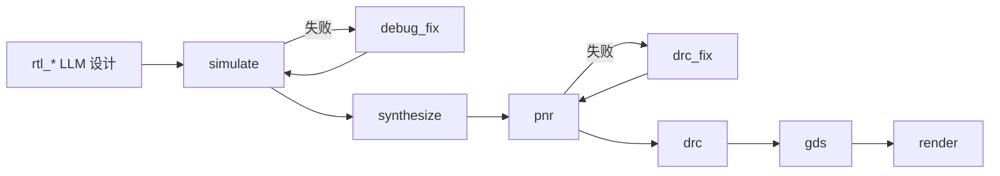

# EDA Studio

[](https://www.python.org/downloads/)
[](LICENSE)

基于 [Senza](https://github.com/oh-my-harness/Senza) SDK 构建的开源 EDA 自动化芯片设计教学项目。用 LLM + 开源 EDA 工具完成 RTL→GDS 全流程,展示 Senza 的 WorkflowEngine 在长流程、多工具、失败恢复场景下的能力。

## EDA Studio 与 Senza 的关系

| | Senza | EDA Studio |
|---|---|---|
| 定位 | Python SDK(WorkflowEngine + judge + executor + hooks) | 基于 Senza 的端到端 EDA 应用 |
| 仓库 | [`oh-my-harness/Senza`](https://github.com/oh-my-harness/Senza) | 本仓库 |
| 安装 | `pip install senza-sdk` | `pip install -e .`(消费 senza-sdk) |
| 角色 | 上游 SDK | 下游消费者 / 教学示例 |
| 关系 | 提供引擎能力 | 验证 SDK 可用性 + 作为 Senza 用户的教学参考 |

EDA Studio 本身也是 Senza 的教学项目:它用一个真实复杂场景(EDA 芯片设计)展示如何用 Senza 的 WorkflowEngine 编排 LLM 步骤与工具调用步骤、实现失败回环路由、做崩溃恢复。

## 快速开始

```bash
# 1. 安装(含 senza-sdk from PyPI + 开发依赖)
pip install -e ".[dev]"

# 2. 配置 API key(复制 .env.example,填入真实 key)
cp .env.example .env && source .env

# 3. 复制配置文件(默认用 glm-5.2,可改 model/api_key)
cp config.example.yaml config.yaml

# 4. 初始化示例 design(从 templates/ 复制)
eda-studio init uart

# 5. 启动 EDA 工具容器(Verilator/Yosys/OpenROAD/Magic/KLayout)
docker run -d --name eda-tools -v $(pwd)/designs:/work/designs \
  -e PDK=sky130A hpretl/iic-osic-tools:latest --skip sleep infinity

# 6. 预检环境(config / API / docker / EDA 工具 / PDK)
eda-studio check

# 7. 运行 RTL→GDS 全流程
eda-studio run uart
# 或启动桌面应用(NiceGUI 原生窗口)
eda-studio gui
# 或启动 Web UI(浏览器访问)
eda-studio serve --port 3000
```

## 模型要求

- **glm-5.2** — 开发主用模型,稳定通过全流程
- **gpt-4o** — 可用
- **Claude (Anthropic)** — 可用;在 `config.yaml` 中设置 `provider.type: anthropic`,`api_key: ${ANTHROPIC_API_KEY}`

弱模型(如小参数模型)可能在 RTL 设计阶段失败(语法错误/不可综合)。配置:复制 `config.example.yaml` 为 `config.yaml`,填入 API key/端点/模型名。支持 `${ENV_VAR}` 展开。OpenAI 兼容 provider(`type: openai`)和 Anthropic(`type: anthropic`)二选一。

## 命令

| 命令 | 说明 |
|------|------|
| `init <design>` | 从模板复制 design 输入文件 |
| `check` | 预检环境(config/API/docker/PDK) |
| `run <design>` | 运行设计流程,终端实时输出 |
| `gui` | 启动桌面应用(NiceGUI 原生窗口) |
| `serve` | 启动 Web UI(浏览器) |
| `restore <design>` | 从断点恢复 |
| `status <design>` | 查看状态 |

## 界面

两种界面共享同一套后端逻辑,三栏布局:

**桌面应用**(推荐):`eda-studio gui` — NiceGUI 原生窗口(1280×800),无需浏览器

**Web UI**:`eda-studio serve --port 3000` — 浏览器访问 `http://localhost:3000`

布局:

- 左栏:workflow 流程图(rtl_tx → ... → gds → render),实时高亮当前 step,LLM/EXEC 类型标签
- 中栏:当前 step 的工具调用和输出,点击任意已完成 step 可回看,显示 token 用量与成本
- 右栏:事件时间线

顶栏实时显示累计成本($)和 token 用量(input/output/cache)。render step 完成后显示 GDS 渲染预览 PNG。

## Workflow

RTL→GDS 全流程,LLM 步骤与 executor 步骤混用:



- **LLM 步骤**:`rtl_*` / `debug_fix` / `drc_fix` — LLM 用内置文件工具(read/write/edit)写 Verilog、读报告、修复失败
- **EXEC 步骤**:`simulate` / `synthesize` / `pnr` / `drc` / `gds` / `render` — 调用容器内 EDA 工具(verilator/yosys/openroad/magic/klayout)

失败回环:仿真失败 → `debug_fix` 修复 RTL → 重跑仿真;DRC 失败 → `drc_fix` 修复 → 重跑 PnR。

## 配置

`config.yaml`(从 `config.example.yaml` 复制):

- `provider`/`model`:OpenAI 兼容端点,支持 `${ENV_VAR}` 展开
- `budget.limit`:预算上限(默认 $5)
- `docker`:EDA 工具容器配置
- `shell`:命令白名单和禁止参数

## 项目结构

```
eda_studio/
├── cli.py              # CLI 入口(run/restore/status/serve/gui/init/check)
├── workflow.py         # 组装 WorkflowEngine + _register_engine(build/restore 共用)
├── webui_nicegui.py    # NiceGUI 桌面应用(三栏 + 事件流)
├── judge.py            # step 路由决策(仿真失败→debug_fix 等)
├── hooks.py            # MaxTokens auto-continue + provider 响应日志
├── plugin.py           # LLM step 的 system prompt 常量
├── shell_safety.py     # docker exec 包装 + 命令白名单
├── config.py           # yaml → dataclass 配置加载
├── design_config.py    # design.yaml 模块规格
├── prompts.py          # LLM step prompt 模板
├── server.py           # FastAPI Web UI 后端
├── state.py            # AppState 共享状态
├── executors/
│   ├── base.py         # ExecutorContext + PDK 路径查找(公共逻辑)
│   ├── simulate.py     # verilator 仿真
│   ├── synthesize.py   # yosys 综合
│   ├── pnr.py          # OpenROAD 布局布线
│   ├── drc.py          # magic DRC 检查
│   ├── gds.py          # klayout GDS 导出
│   └── render.py       # GDS → PNG 渲染
└── templates/          # 示例 design(uart/i2c)
```

详见 [docs/development.md](docs/development.md) 和 [docs/](docs/)。

## 从源码开发 Senza

如需同时修改 Senza 的 Rust 源码(上游 SDK),可用 `scripts/install-senza-dev.sh`
从本地 Senza checkout editable 安装:

```bash
# 假设 Senza 在 ../Senza
./scripts/install-senza-dev.sh
```

详见 [scripts/install-senza-dev.sh](scripts/install-senza-dev.sh)。

## 贡献

见 [CONTRIBUTING.md](CONTRIBUTING.md)。

## License

[MIT](LICENSE)
