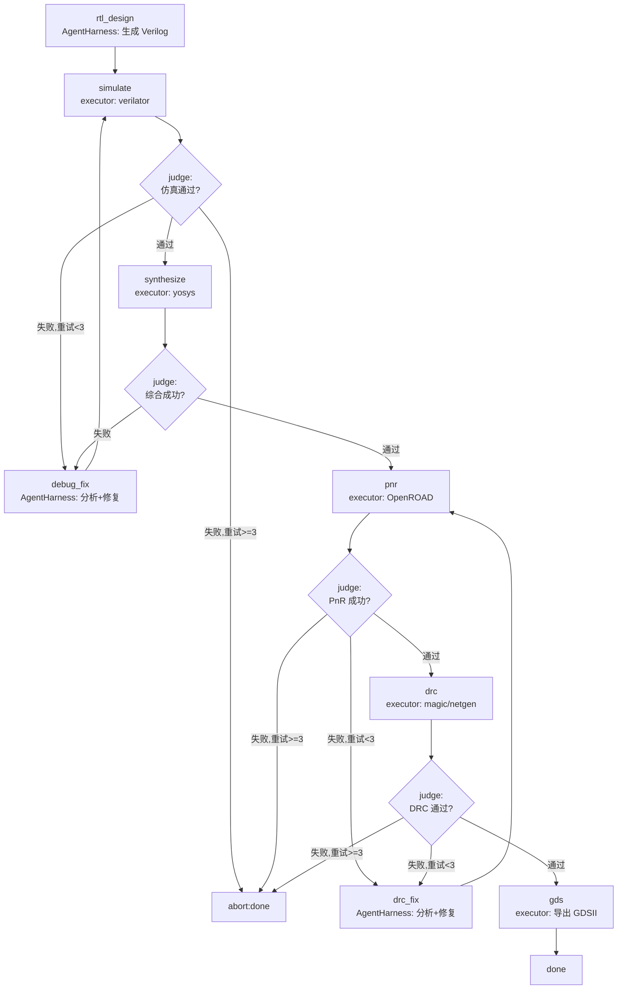

# Senza EDA Studio —— 开源 EDA 自动化芯片设计流程

> 日期：2026-07-18
> 主题：基于 Senza 构建的真实项目，用开源 EDA 工具完成 RTL→GDS 全流程
> 范围：项目设计、workflow 编排、工具集成、教学分解
> 依赖：Senza 0.3.1+ 已暴露 API + `feat/senza-api-exposure` 分支的 G1/G2/G3（假设已实现）

---

## 1. 背景

Senza 是 oh-my-harness runtime 的 Python SDK。当前仓库的 `examples/` 提供 14 个独立小示例，但缺少一个**真实复杂项目**来：

1. 验证 senza 在长流程、多工具、多 provider、失败恢复场景下的可用性
2. 作为教学示例展示 `WorkflowEngine` 包 `AgentHarness` 的两层集成模式
3. 展示 senza 的差异化能力（judge 路由、executor、hooks、崩溃恢复、多 provider、budget/rules/pricing）

本项目用开源 EDA 工具链（verilator + yosys + OpenROAD）完成一个中等复杂度数字电路（UART）的 RTL→GDS 全流程，由 LLM 生成 RTL 并在失败时修复。

### 为什么选 EDA 场景

- **长流程**：RTL→仿真→综合→PnR→DRC→GDS，6+ 步骤，天然适合 workflow 编排
- **工具调用**：每步调外部 CLI（verilator/yosys/OpenROAD），展示 executor + shell 工具
- **报告解析**：每步产生报告（仿真日志、综合报告、DRC 报告），judge 需解析决策，展示 LLM 分析能力
- **失败迭代**：仿真失败、DRC 失败是常态，展示 LLM 修复 + workflow 回环路由
- **崩溃恢复**：流程可能跑到一半中断，展示 `with_task_store` + `restore()`
- **成本控制**：多轮 LLM 调用，展示 budget/pricing
- **安全防护**：shell 命令调用，展示 rules 审批

---

## 2. 目标

### 核心目标

1. **可运行**：给定 `config.yaml`（provider 配置）+ Docker 容器运行中，`python -m eda_studio run uart` 能跑完 RTL→GDS 并产出 `designs/uart/gds/*.gds`
2. **教学性**：项目结构清晰，每层职责明确，可作为 senza 用户的教学参考
3. **验证 senza**：覆盖 Agent 层（AgentHarness + tools + steering）、Runtime 层（WorkflowEngine + judge + executor + hooks + restore）、新 API（budget/pricing/rules）

### 非目标

- EDA 工具通过 Docker 镜像提供（`iic-osic-tools`），不直接安装到宿主机
- 不追求工业级 PPA 优化（教学项目，流程跑通即可）
- 不做 Web UI（纯 CLI + 文件产物）
- 不做完整的教学文档分解（先做项目，后做分解）

### 成功标准

| # | 标准 | 验证方式 |
|---|------|---------|
| S1 | `python -m eda_studio run uart` 从零产出 GDSII 文件 | 检查 `designs/uart/gds/*.gds` 存在 |
| S2 | 仿真失败时 LLM 能分析报告并修复 RTL，流程回环到 simulate | 检查 step_history 有 debug_fix → simulate 的路由 |
| S3 | DRC 失败时 LLM 能分析报告并修复，流程回环到 pnr | 检查 step_history 有 drc_fix → pnr 的路由 |
| S4 | 中断后 `python -m eda_studio restore uart` 能从断点继续 | 模拟 Ctrl+C 后 restore，检查 current_step 正确 |
| S5 | 成本超限时流程停止，记录已用成本 | 设 budget=0.01 触发，检查 state="failed" + usage 有值 |
| S6 | 危险 shell 命令被 rules 拦截 | 构造恶意 tool call，检查被 deny |
| S7 | 多 provider 配置生效（RTL 用 gpt-4o，debug 用 deepseek） | 检查 usage()["by_model"] 有两个模型 |

---

## 3. 架构

### 3.1 两层集成模式

```
┌─────────────────────────────────────────────────────────┐
│  WorkflowEngine（外层编排）                              │
│  ┌──────────┐    ┌──────────┐    ┌──────────┐          │
│  │ rtl_design│    │ debug_fix│    │ drc_fix  │          │
│  │ (LLM节点) │    │ (LLM节点) │    │ (LLM节点) │          │
│  │ 内嵌      │    │ 内嵌      │    │ 内嵌      │          │
│  │ AgentHarness│  │ AgentHarness│  │ AgentHarness│        │
│  └────┬─────┘    └────┬─────┘    └────┬─────┘          │
│       │                │                │                │
│  ┌────▼─────┐    ┌────▼─────┐    ┌────▼─────┐          │
│  │ simulate │    │ (回环)    │    │ (回环)    │          │
│  │ (executor)│   │           │   │           │          │
│  └────┬─────┘    └──────────┘    └──────────┘          │
│       │                                                 │
│  ┌────▼─────┐    ┌──────────┐    ┌──────────┐          │
│  │synthesize│───▶│   pnr    │───▶│   drc    │───▶ gds  │
│  │ (executor)│   │ (executor)│   │ (executor)│  (executor)│
│  └──────────┘    └──────────┘    └──────────┘          │
│                                                         │
│  judge: 解析 executor 报告 → 路由决策                    │
│  hooks: 日志/成本/审计/检查点                            │
│  budget: 成本超限停止                                    │
│  rules: shell 命令审批                                  │
│  pricing: 多 provider 成本统计                          │
└─────────────────────────────────────────────────────────┘
```

### 3.2 Workflow 流程图



### 3.3 项目结构

**独立仓库**（不在 Senza 仓库内），通过 `pip install senza-sdk` 引入依赖。这额外验证了 PyPI 包的可用性。

仓库地址：`github.com/oh-my-harness/eda-studio`（待创建）

```
eda-studio/                        # 独立仓库
├── README.md                      # 项目介绍 + 快速开始
├── pyproject.toml                 # 依赖：senza-sdk>=0.3.1 (from PyPI)
├── config.example.yaml            # provider/model/budget/docker 配置示例
├── eda_studio/
│   ├── __init__.py
│   ├── __main__.py                # CLI 入口：run / restore / status
│   ├── config.py                  # 加载 config.yaml → 创建 providers + pricing
│   ├── workflow.py                # workflow 定义 + WorkflowEngine 构建
│   ├── judge.py                   # judge 逻辑：报告解析 → 路由决策
│   ├── hooks.py                   # 日志/成本/审计/检查点 hooks
│   ├── rules.py                   # shell 命令审批 rules
│   ├── tools/                     # AgentHarness 的 tools（LLM 可调用）
│   │   ├── __init__.py
│   │   ├── file_tools.py          # 读写 RTL/SDC/报告文件
│   │   └── report_tools.py        # 解析仿真/综合/DRC 报告摘要
│   ├── agents/                    # AgentHarness 工厂
│   │   ├── __init__.py
│   │   ├── rtl_agent.py           # RTL 设计 agent（生成 + 修复）
│   │   ├── debug_agent.py         # 仿真失败分析 agent
│   │   └── drc_agent.py           # DRC 失败修复 agent
│   └── executors/                 # workflow executor 步骤
│       ├── __init__.py
│       ├── simulate.py            # verilator 仿真 executor
│       ├── synthesize.py          # yosys 综合 executor
│       ├── pnr.py                 # OpenROAD PnR executor
│       ├── drc.py                 # DRC/LVS 检查 executor
│       └── gds.py                 # GDS 导出 executor
├── designs/                       # 设计工作区（运行时生成）
│   └── uart/                      # 默认示例设计
│       ├── rtl/                   # Verilog 源码
│       ├── sim/                   # 仿真输出
│       ├── synth/                 # 综合输出 (netlist)
│       ├── pnr/                   # PnR 输出 (DEF)
│       ├── gds/                   # GDSII 最终产物
│       └── .taskstore/            # 崩溃恢复状态
└── tests/
    ├── test_judge.py              # judge 路由逻辑
    ├── test_tools.py              # 工具单元测试
    └── test_workflow.py           # workflow 集成测试（mock EDA 工具）
```

**安装与运行**：

```bash
git clone https://github.com/oh-my-harness/eda-studio.git
cd eda-studio
pip install -e .
cp config.example.yaml config.yaml  # 编辑 provider 配置
python -m eda_studio run uart
```

---

## 4. 详细设计

### 4.1 配置系统（`config.py`）

```python
# config.yaml 示例
providers:
  - type: openai
    api_key: ${OPENAI_API_KEY}
    models: ["gpt-4o", "gpt-4o-mini"]
  - type: anthropic
    api_key: ${ANTHROPIC_API_KEY}
    models: ["claude-3-5-sonnet-*"]
  - type: openai  # DeepSeek 走 OpenAI 兼容接口
    api_key: ${DEEPSEEK_API_KEY}
    base_url: "https://api.deepseek.com"
    models: ["deepseek-*"]

pricing:
  gpt-4o:
    input_per_mtok: 2.5
    output_per_mtok: 10.0
  deepseek-chat:
    input_per_mtok: 0.14
    output_per_mtok: 0.28

agents:
  rtl_design:
    model: "gpt-4o"
    max_tokens: 4096
    temperature: 0.3
  debug_fix:
    model: "deepseek-chat"
    max_tokens: 4096
    temperature: 0.2
  drc_fix:
    model: "claude-3-5-sonnet-20241022"
    max_tokens: 4096

budget:
  limit: 5.0          # 最大花费 $5
  exceeded_action: stop  # stop | continue

workflow:
  max_steps: 50
  max_retries: 3      # 每个修复环节最大重试次数

rules:
  shell:
    allowed_commands: ["verilator", "yosys", "openroad", "magic", "netgen", "klayout"]
    denied_args: ["rm", "chmod", "sudo", ">", "|"]  # 危险参数

docker:
  image: "hpretl/iic-osic-tools:latest"
  container: "eda-tools"
  workdir: "/work/designs"   # 容器内挂载点
  pdk: "sky130A"             # 预装 PDK


**`config.py` 职责**：

```python
@dataclass
class AppConfig:
    providers: list[Provider]       # senza provider 实例
    pricing_table: PricingProvider  # senza PricingProvider（G2）
    agent_configs: dict[str, AgentConfig]
    budget_limit: float
    workflow_config: WorkflowConfig
    rules_config: RulesConfig
    docker_config: DockerConfig     # EDA 工具容器配置

@dataclass
class DockerConfig:
    image: str          # "hpretl/iic-osic-tools:latest"
    container: str      # "eda-tools"
    workdir: str        # "/work/designs" 容器内挂载点
    pdk: str            # "sky130A"

def load_config(path: str) -> AppConfig:
    """加载 yaml → 创建 senza provider/pricing 实例"""
    # 1. 解析 yaml，展开 ${ENV_VAR}
    # 2. 为每个 provider 调 create_openai_provider / create_anthropic_provider
    # 3. 调 create_pricing_provider(pricing_table) （G2）
    # 4. 返回 AppConfig
```

**展示的 senza 能力**：
- `create_openai_provider(base_url=...)` — DeepSeek 兼容接口
- `create_anthropic_provider()`
- `create_pricing_provider(table)` — G2 新 API

### 4.2 Workflow 定义（`workflow.py`）

```python
def build_workflow(config: AppConfig, design_name: str) -> WorkflowEngine:
    workflow_dict = {
        "entry_step": "rtl_design",
        "steps": [
            {
                "id": "rtl_design",
                "name": "RTL 设计",
                "type": "agent",  # 自定义标记，judge/executors 识别
                "agent": "rtl_design",  # 引用 agent_configs 的 key
            },
            {
                "id": "simulate",
                "name": "仿真验证",
                "type": "executor",
                "executor": "simulate",
            },
            {
                "id": "debug_fix",
                "name": "仿真修复",
                "type": "agent",
                "agent": "debug_fix",
            },
            {
                "id": "synthesize",
                "name": "逻辑综合",
                "type": "executor",
                "executor": "synthesize",
            },
            {
                "id": "pnr",
                "name": "布局布线",
                "type": "executor",
                "executor": "pnr",
            },
            {
                "id": "drc_fix",
                "name": "DRC 修复",
                "type": "agent",
                "agent": "drc_fix",
            },
            {
                "id": "drc",
                "name": "DRC 检查",
                "type": "executor",
                "executor": "drc",
            },
            {
                "id": "gds",
                "name": "GDS 导出",
                "type": "executor",
                "executor": "gds",
            },
        ],
        "edges": [
            {"from": "rtl_design", "to": "simulate"},
            {"from": "simulate", "to": "synthesize"},       # 默认边，judge 可覆盖
            {"from": "debug_fix", "to": "simulate"},
            {"from": "synthesize", "to": "pnr"},
            {"from": "pnr", "to": "drc"},
            {"from": "drc_fix", "to": "pnr"},
            {"from": "drc", "to": "gds"},
            {"from": "gds", "to": "done"},
        ],
    }

    judge = create_judge(make_judge_fn(config))
    engine = WorkflowEngine(workflow_dict, provider, model, judge)

    # 注册 executors
    engine = (
        engine
        .with_executor("simulate", create_executor(simulate_executor))
        .with_executor("synthesize", create_executor(synthesize_executor))
        .with_executor("pnr", create_executor(pnr_executor))
        .with_executor("drc", create_executor(drc_executor))
        .with_executor("gds", create_executor(gds_executor))
        .with_hooks(make_hooks(config))
        .with_task_store(f"designs/{design_name}/.taskstore")
        .with_max_steps(config.workflow_config.max_steps)
        .with_max_retries(config.workflow_config.max_retries)
        .with_max_tokens(config.agent_configs["rtl_design"].max_tokens)
    )

    # G1: Budget 控制 — budget_hook 实现 ShouldStopHook，通过 with_hooks 注册
    # G1 spec 定义 builder.budget(limit, hook) 在 AgentHarness 级；
    # WorkflowEngine 级无 with_budget，故通过 with_hooks 通路注入
    budget_hook = create_budget_exceeded_hook(make_budget_cb(config))
    engine = engine.with_hooks([budget_hook])

    return engine
```

**展示的 senza 能力**：
- `WorkflowEngine(workflow_dict, provider, model, judge)` — 声明式 workflow
- `.with_executor(name, exec)` — executor 注册
- `.with_hooks([hooks])` — hooks 注册
- `.with_task_store(dir)` — 持久化
- `.with_max_steps(n)` / `.with_max_retries(n)` — 限制
- `create_judge(fn)` — judge
- `create_budget_exceeded_hook(cb)` — G1 新 API
- `engine.with_hooks([budget_hook])` — G1 budget hook 通过 hooks 通路注册（budget_hook impl ShouldStopHook）

### 4.3 AgentHarness 工厂（`agents/`）

每个 LLM 步骤内嵌一个 `AgentHarness`。在 executor/step 回调中实例化并运行。

```python
# agents/rtl_agent.py
def make_rtl_agent(config: AppConfig, design_dir: Path) -> AgentHarness:
    agent_cfg = config.agent_configs["rtl_design"]
    builder = (
        HarnessBuilder(agent_cfg.model)
        .provider("gpt-*", config.providers["openai"])
        .provider("deepseek-*", config.providers["deepseek"])
        .provider("claude-*", config.providers["anthropic"])
        .system_prompt(RTL_SYSTEM_PROMPT)
        .max_tokens(agent_cfg.max_tokens)
        .temperature(agent_cfg.temperature)
        .tool(create_tool("write_rtl", "写 Verilog 文件", WRITE_RTL_SCHEMA, write_rtl_fn))
        .tool(create_tool("read_rtl", "读 Verilog 文件", READ_RTL_SCHEMA, read_rtl_fn))
        .tool(create_tool("list_design_files", "列出工作区文件", LIST_SCHEMA, list_files_fn))
        .pricing(config.pricing_table)  # G2
    )
    return builder.build()
```

**LLM 步骤如何嵌入 workflow**：

senza 的 `WorkflowEngine` step 如果是 LLM 步骤，默认用自己的 prompt+tools。但我们要用 `AgentHarness` 获得动态配置能力。方案：**用 executor 步骤包装 AgentHarness**。

```python
# executors/rtl_design_executor.py（实际由 agents/rtl_agent.py 提供）
def rtl_design_executor(ctx: dict) -> dict:
    """这个 executor 内部跑一个 AgentHarness"""
    config = ctx["config"]
    design_dir = ctx["design_dir"]
    requirement = ctx["requirement"]

    agent = make_rtl_agent(config, design_dir)
    events = agent.prompt_and_collect(
        f"请设计以下电路的 Verilog RTL：\n\n{requirement}\n\n"
        f"用 write_rtl 工具写入 designs/{design_dir.name}/rtl/ 目录。",
        timeout_ms=120000,
    )

    # 收集结果
    text = ""
    for event in events:
        if event["type"] == "text_delta":
            text += event.get("text", "")

    return {
        "output": text,
        "files_written": list_rtl_files(design_dir),
        "usage": agent.usage(),
    }
```

**关键设计决策**：所有 LLM 步骤（rtl_design / debug_fix / drc_fix）都实现为 **executor**，内部实例化 AgentHarness。这样：
- workflow 定义统一（全是 executor 步骤）
- AgentHarness 可自由配置（专属 system prompt、tools、model）
- judge 逻辑统一（只看 executor 返回的 dict）
- 展示了 `create_executor(cb)` 包装 AgentHarness 的模式

**展示的 senza 能力**：
- `HarnessBuilder` fluent API（model/provider/system_prompt/max_tokens/temperature/tool）
- `create_tool()` — 工具创建
- `.pricing(provider)` — G2 新 API
- `.provider(pattern, provider)` — glob 多 provider 路由
- `agent.prompt_and_collect()` — 发送 prompt + 收集事件
- `agent.usage()` — 成本查询

### 4.4 工具设计（`tools/`）

#### file_tools.py

```python
def write_rtl_fn(args: dict, ctx: dict) -> dict:
    """写 Verilog 文件到 design_dir/rtl/"""
    filename = args["filename"]  # 如 "uart_tx.v"
    content = args["content"]
    design_dir = Path(ctx["design_dir"])
    path = design_dir / "rtl" / filename
    path.parent.mkdir(parents=True, exist_ok=True)
    path.write_text(content)
    return {"content": [{"type": "text", "text": f"已写入 {path}"}], "terminate": False}

def read_rtl_fn(args: dict, ctx: dict) -> dict:
    """读 Verilog 文件"""
    filename = args["filename"]
    path = Path(ctx["design_dir"]) / "rtl" / filename
    if not path.exists():
        return {"content": [{"type": "text", "text": f"文件不存在: {filename}"}], "terminate": False}
    return {"content": [{"type": "text", "text": path.read_text()}], "terminate": False}
```

#### report_tools.py

```python
def read_sim_report_fn(args: dict, ctx: dict) -> dict:
    """读仿真报告摘要"""
    path = Path(ctx["design_dir"]) / "sim" / "report.txt"
    if not path.exists():
        return {"content": [{"type": "text", "text": "无仿真报告"}], "terminate": False}
    report = path.read_text()
    # 截取关键部分（错误行、失败断言）
    summary = extract_sim_errors(report)
    return {"content": [{"type": "text", "text": summary}], "terminate": False}

def read_drc_report_fn(args: dict, ctx: dict) -> dict:
    """读 DRC 报告"""
    path = Path(ctx["design_dir"]) / "pnr" / "drc.rpt"
    ...
```

### 4.5 Executor 设计（`executors/`）

每个 executor 是一个 Python 函数，签名 `(ctx: dict) -> dict`，通过 `create_executor()` 注册。

#### `run_shell()` 封装（`executors/__init__.py`）

所有 EDA 工具调用通过 `run_shell()` 封装，内部自动加 `docker exec` 前缀。executor 代码只写工具名和参数，不感知 Docker：

```python
import subprocess
from pathlib import Path

def run_shell(cmd: list[str], cwd: Path, config: 'DockerConfig') -> subprocess.CompletedProcess:
    """在 Docker 容器内执行命令。

    本地 designs/ 目录挂载到容器 /work/designs/，所以 cwd 要转换成容器内路径。
    """
    # 宿主机路径 → 容器内路径
    container_cwd = str(cwd).replace(str(Path("designs").resolve()), config.workdir)

    docker_cmd = [
        "docker", "exec", "-w", container_cwd,
        config.container,  # 容器名，如 "eda-tools"
        *cmd,
    ]
    return subprocess.run(docker_cmd, capture_output=True, text=True, timeout=600)
```

> executor 调用时传 `config=ctx["config"].docker_config`。环境变量 `PDK=sky130A` 由容器启动时设置。

#### simulate.py

```python
def simulate_executor(ctx: dict) -> dict:
    """verilator 仿真"""
    design_dir = Path(ctx["design_dir"])
    rtl_files = list((design_dir / "rtl").glob("*.v"))
    tb_file = design_dir / "rtl" / "tb_uart.v"  # testbench

    cmd = [
        "verilator", "--binary", "--timing",
        "-Wall",
        "--top-module", "tb_uart",
        *rtl_files, str(tb_file),
        "-o", "sim_out",
    ]
    result = run_shell(cmd, cwd=design_dir / "sim")

    # 运行仿真
    run_result = run_shell(["./sim_out"], cwd=design_dir / "sim")

    # 生成报告
    report = parse_verilator_output(result.stderr, run_result.stdout)
    (design_dir / "sim" / "report.txt").write_text(report)

    return {
        "output": report,
        "success": run_result.returncode == 0,
        "report_path": str(design_dir / "sim" / "report.txt"),
    }
```

#### synthesize.py

```python
def synthesize_executor(ctx: dict) -> dict:
    """yosys 综合"""
    design_dir = Path(ctx["design_dir"])
    rtl_files = sorted((design_dir / "rtl").glob("*.v"))
    json_out = design_dir / "synth" / "netlist.json"

    script = f"""
read_verilog {' '.join(str(f) for f in rtl_files)}
synth -top uart
stat
write_json {json_out}
write_verilog {design_dir / 'synth' / 'netlist.v'}
"""
    result = run_shell(["yosys", "-q", "-p", script], cwd=design_dir / "synth")
    report = result.stdout + result.stderr
    (design_dir / "synth" / "report.txt").write_text(report)

    return {
        "output": report,
        "success": result.returncode == 0 and json_out.exists(),
        "report_path": str(design_dir / "synth" / "report.txt"),
    }
```

#### pnr.py

```python
def pnr_executor(ctx: dict) -> dict:
    """OpenROAD 布局布线"""
    design_dir = Path(ctx["design_dir"])
    netlist = design_dir / "synth" / "netlist.json"

    # OpenROAD Tcl 脚本（简化）
    tcl = f"""
read_libs sky130/sky130_fd_sc_hd__tt_025C_1v80.lib
read_lef sky130/sky130_fd_sc_hd.lef
read_def {design_dir / 'pnr' / 'uart.def'}
read_json {netlist}
initialize_floorplan -utilization 40 -site unithd
place_pins -hor_layers metal2 -ver_layers metal3
global_placement
detailed_placement
global_route
detailed_route
write_def {design_dir / 'pnr' / 'uart_pnr.def'}
"""
    result = run_shell(["openroad", "-exit_on_error", "-no_splash", "-cmd", tcl],
                       cwd=design_dir / "pnr")
    ...
```

#### drc.py / gds.py

类似模式，调 magic 做 DRC、klayout 导出 GDS。

### 4.6 Judge 设计（`judge.py`）

```python
def make_judge_fn(config: AppConfig):
    def judge(ctx: dict) -> str:
        step_id = ctx["step_id"]
        result = ctx.get("result", {})

        if step_id == "rtl_design":
            # RTL 生成了文件就继续
            files = result.get("files_written", [])
            return "to:simulate" if files else "abort:done"

        if step_id == "simulate":
            success = result.get("success", False)
            retries = ctx.get("retry_count", 0)
            if success:
                return "to:synthesize"
            if retries >= config.workflow_config.max_retries:
                return "abort:done"
            return "to:debug_fix"

        if step_id == "debug_fix":
            # 修复后重跑仿真
            return "to:simulate"

        if step_id == "synthesize":
            success = result.get("success", False)
            return "to:pnr" if success else "to:debug_fix"

        if step_id == "pnr":
            success = result.get("success", False)
            retries = ctx.get("retry_count", 0)
            if success:
                return "to:drc"
            if retries >= config.workflow_config.max_retries:
                return "abort:done"
            return "to:drc_fix"

        if step_id == "drc_fix":
            return "to:pnr"

        if step_id == "drc":
            success = result.get("success", False)
            retries = ctx.get("retry_count", 0)
            if success:
                return "to:gds"
            if retries >= config.workflow_config.max_retries:
                return "abort:done"
            return "to:drc_fix"

        if step_id == "gds":
            return "done"

        return "abort:done"

    return judge
```

**展示的 senza 能力**：
- `create_judge(fn)` — Python callable → judge
- `to:step_id` / `abort:done` — 路由语法
- 重试计数 → 超限 abort

### 4.7 Hooks 设计（`hooks.py`）

```python
def make_hooks(config: AppConfig):
    hooks = []

    # 日志 hook
    @create_before_turn_hook
    def log_before_turn(ctx: dict) -> None:
        step_id = ctx["step_id"]
        logger.info(f"▶ {step_id} 开始")

    @create_after_turn_hook
    def log_after_turn(ctx: dict) -> None:
        step_id = ctx["step_id"]
        duration = ctx.get("duration_ms", 0)
        logger.info(f"✓ {step_id} 完成 ({duration}ms)")

    hooks.extend([log_before_turn, log_after_turn])

    # 文件变更审计 hook
    @create_after_tool_call_hook
    def audit_tool_call(ctx: dict) -> str:
        tool_name = ctx["tool_name"]
        tool_args = ctx["tool_args"]
        logger.info(f"  tool call: {tool_name}({tool_args})")
        # 返回 None 表示不修改结果
        return None

    hooks.append(audit_tool_call)

    return hooks
```

**展示的 senza 能力**：
- `create_before_turn_hook` / `create_after_turn_hook` — 生命周期
- `create_after_tool_call_hook` — 工具调用审计

### 4.8 Rules 审批（`rules.py`，G3 新 API）

```python
def make_rules(config: AppConfig):
    """构建 shell 命令审批规则链"""
    builder = create_rule_chain()

    # 规则1：只允许白名单命令
    allowed = config.rules_config.shell.allowed_commands
    builder = builder.rule(
        tool_name="*",
        predicate=create_contains_predicate(allowed),  # 检查命令在白名单
        on_match="allow",
    )

    # 规则2：拒绝危险参数
    builder = builder.rule(
        tool_name="*",
        predicate=create_regex_field_predicate("command", r".*(rm|chmod|sudo).*"),
        on_match="deny",
    )

    # fallback：默认拒绝
    builder = builder.fallback("deny")

    chain = builder.build()
    return create_rule_approval_hook(chain)
```

注册到 AgentHarness 或 workflow hooks（根据 G3 设计，`RuleBasedApprovalHook` impl `BeforeToolCallHook`）。

**展示的 senza 能力**（G3 新 API）：
- `create_rule_chain()` — RuleChainBuilder
- `create_contains_predicate()` / `create_regex_field_predicate()` — Predicate
- `RuleChainBuilder.rule().fallback().build()` — 链式构建
- `create_rule_approval_hook(chain)` — 生成 hook

### 4.9 Budget 控制（G1 新 API）

```python
def make_budget_cb(config: AppConfig):
    def on_budget_exceeded(cost: dict, limit: float) -> bool:
        logger.warning(f"预算超限！已用 ${cost['total_cost']:.2f} / ${limit:.2f}")
        # exceeded_action: stop → False, continue → True
        return config.budget.exceeded_action == "continue"
    return on_budget_cb

# 在 workflow.py 中：
budget_hook = create_budget_exceeded_hook(make_budget_cb(config))
engine = engine.with_hooks([budget_hook])  # budget_hook impl ShouldStopHook
```

> **注**：G1 spec 定义 `builder.budget(limit, hook)` 在 `HarnessBuilder`（AgentHarness 级）。
> `WorkflowEngine` 无对应方法，故 workflow 级通过 `with_hooks([budget_hook])` 注入。
> `budget_hook` 内部实现 `ShouldStopHook`，senza runtime 会自动调用。
> 若需在 AgentHarness 级控制成本，在 `agents/*.py` 的 builder 上调 `.budget(limit, hook)`。

**展示的 senza 能力**（G1）：
- `create_budget_exceeded_hook(cb)` — cb(cost, limit) -> bool
- `engine.with_hooks([budget_hook])` — workflow 级注入
- `builder.budget(limit, hook)` — AgentHarness 级注入（agents/ 中使用）

### 4.10 崩溃恢复

```python
# __main__.py
def cmd_restore(design_name: str, config_path: str):
    config = load_config(config_path)
    store_dir = f"designs/{design_name}/.taskstore"

    # 读取 task_id
    task_id = (Path(store_dir) / "task_id").read_text().strip()

    engine = WorkflowEngine.restore(
        store_dir, task_id,
        provider=config.providers[0],
        model=config.agent_configs["rtl_design"].model,
        judge=create_judge(make_judge_fn(config)),
    )

    print(f"恢复到步骤: {engine.current_step()}")
    print(f"已完成: {len(engine.step_history())} 步")
    engine.run()
```

**展示的 senza 能力**：
- `WorkflowEngine.restore(store_dir, task_id, provider, model, judge)` — 类方法恢复
- `.current_step()` / `.step_history()` — 状态查询

### 4.11 CLI 入口

```python
# __main__.py
"""
Usage:
  python -m eda_studio run <design> [--config config.yaml]
  python -m eda_studio restore <design> [--config config.yaml]
  python -m eda_studio status <design>
"""
```

---

## 5. 数据流

### 5.1 运行时上下文（ctx）

workflow 的 ctx dict 在步骤间传递，关键字段：

```python
ctx = {
    "design_dir": "designs/uart",
    "requirement": "设计一个 UART 收发器，波特率 115200，8N1",
    "config": app_config,  # 完整配置（供 executor 访问）
    "step_id": "rtl_design",
    "retry_count": 0,      # judge 维护
    "result": {...},       # 上一步结果
}
```

### 5.2 文件产物

每步产出文件到 `designs/<name>/` 对应子目录，executor 和 agent 都通过 `ctx["design_dir"]` 定位。

```
designs/uart/
├── rtl/
│   ├── uart_tx.v         # rtl_design 产出
│   ├── uart_rx.v
│   └── tb_uart.v
├── sim/
│   ├── sim_out           # simulate 产出（二进制）
│   └── report.txt        # simulate 产出（报告）
├── synth/
│   ├── netlist.json      # synthesize 产出
│   ├── netlist.v
│   └── report.txt
├── pnr/
│   ├── uart_pnr.def      # pnr 产出
│   └── drc.rpt           # drc 产出
├── gds/
│   └── uart.gds          # gds 产出（最终产物）
└── .taskstore/           # 崩溃恢复状态
```

---

## 6. 错误处理

| 场景 | 处理 |
|------|------|
| EDA 工具未安装 | executor 返回 `success=False`，judge 路由 `abort:done`，日志提示安装 |
| LLM 生成 RTL 语法错误 | verilator 编译失败 → simulate `success=False` → judge 路由到 debug_fix |
| 仿真修复超过 max_retries | judge 返回 `abort:done`，记录失败原因 |
| DRC 反复失败 | 同上 |
| API key 缺失 | `load_config()` 启动时报错 |
| LLM API 超时 | `prompt_and_collect` 的 timeout_ms 触发，executor 返回失败 |
| 成本超限 | budget hook 触发，流程 state → "failed" |
| 危险 shell 命令 | rules hook 拦截，返回 deny |

---

## 7. 测试策略

### 7.1 单元测试

| 测试 | 覆盖 | 方法 |
|------|------|------|
| `test_judge.py` | judge 路由逻辑 | 构造 ctx dict，断言 judge 返回值 |
| `test_tools.py` | file/report 工具 | tmp_path 构造文件，断言读写正确 |
| `test_config.py` | 配置加载 | tmp config.yaml，断言 provider/pricing 创建 |

### 7.2 集成测试

| 测试 | 覆盖 | 方法 |
|------|------|------|
| `test_workflow.py` | workflow 端到端 | mock executor（不调真实 EDA 工具），验证路由和回环 |

**不依赖真实 EDA 工具和 LLM API**——executor mock 返回固定报告，agent mock 返回固定 RTL。

### 7.3 手动验收

用真实 EDA 工具 + LLM API 跑 UART 设计，验证 S1-S7 成功标准。

---

## 8. 依赖

### Python 依赖

```toml
# pyproject.toml
[project]
name = "eda-studio"
version = "0.1.0"
dependencies = [
    "senza-sdk>=0.3.1",   # 从 PyPI 安装，验证发布包可用性
    "pyyaml>=6.0",
]
```

> **关键验证点**：本项目不依赖本地 dev wheel，而是通过 `pip install senza-sdk` 从 PyPI 安装。
> 这验证了 Senza 的 wheel 构建、PyPI 发布、abi3 兼容性是否真正可用。

### EDA 工具（Docker 镜像）

所有 EDA 工具通过 [`iic-osic-tools`](https://github.com/iic-jku/iic-osic-tools) Docker 镜像提供，**不在宿主机安装**。镜像基于 Ubuntu 24.04，原生支持 amd64 和 arm64（Apple Silicon 无需 Rosetta），预装以下工具和 PDK：

| 工具 | 用途 | 镜像内路径 |
|------|------|-----------|
| verilator | RTL 仿真 | `/usr/local/bin/verilator` |
| yosys | 逻辑综合 | `/usr/local/bin/yosys` |
| openroad | 布局布线 | `/usr/local/bin/openroad` |
| magic | DRC / 版图 | `/usr/local/bin/magic` |
| netgen | LVS | `/usr/local/bin/netgen` |
| klayout | GDS 查看/导出 | `/usr/local/bin/klayout` |

### 工艺库

- SkyWater Sky130 `sky130A`（开源 PDK，镜像预装）
- 环境变量 `PDK=sky130A`、`PDKPATH`、`STD_CELL_LIBRARY=sky130_fd_sc_hd` 由容器自动设置

### Docker 容器管理

```bash
# 启动容器（挂载 designs 目录，保持后台运行）
docker run -d --name eda-tools \
  -v $(pwd)/designs:/work/designs \
  -e PDK=sky130A \
  hpretl/iic-osic-tools:latest \
  tail -f /dev/null

# senza 程序通过 docker exec 调用容器内工具
docker exec eda-tools verilator --version
docker exec eda-tools yosys -V
docker exec -w /work/designs/uart/sim eda-tools verilator --binary ...
```

senza 的 `run_shell()` 函数封装了 docker exec 前缀（见 §4.5 executor 设计），executor 代码不直接感知 Docker。

---

## 9. 展示的 senza 能力总结

| 能力 | 展示位置 | API |
|------|---------|-----|
| **WorkflowEngine** 声明式 workflow | workflow.py | `WorkflowEngine(dict, provider, model, judge)` |
| **judge 条件路由** | judge.py | `create_judge(fn)`, `to:step` / `abort:done` |
| **executor 步骤** | executors/ | `create_executor(fn)`, `.with_executor()` |
| **AgentHarness 内嵌** | agents/ + executors/ | executor 内 `HarnessBuilder.build().prompt_and_collect()` |
| **HarnessBuilder fluent API** | agents/ | model/provider/system_prompt/max_tokens/temperature/tool |
| **create_tool** | tools/ | `create_tool(name, desc, schema, fn)` |
| **多 provider glob 路由** | agents/ | `.provider("gpt-*", p).provider("deepseek-*", p)` |
| **hooks（4 种）** | hooks.py | before_turn / after_turn / after_tool_call / should_stop |
| **崩溃恢复** | __main__.py | `with_task_store()`, `WorkflowEngine.restore()` |
| **streaming 事件** | agents/ | `prompt_and_collect()` 返回事件列表 |
| **usage 成本查询** | agents/ | `agent.usage()` |
| **G1 Budget** | workflow.py + agents/ | `create_budget_exceeded_hook()`, `with_hooks([budget_hook])` / `builder.budget()` |
| **G2 Pricing** | config.py + agents/ | `create_pricing_provider()`, `.pricing()` |
| **G3 Rules 审批** | rules.py | `create_rule_chain()`, predicates, `create_rule_approval_hook()` |

---

## 10. 教学分解（后续阶段）

项目跑通后，再分解为教学材料：

1. **项目结构概览** — 两层集成模式
2. **Provider 配置** — 多 provider + pricing
3. **Tool 定义** — LLM 可调用的工具
4. **AgentHarness 工厂** — 每个 LLM 步骤的 agent
5. **Executor 设计** — EDA 工具调用
6. **Workflow 定义** — 声明式流程图
7. **Judge 路由** — 报告解析 + 条件跳转
8. **Hooks** — 可观测性
9. **Budget/Rules** — 安全与成本控制
10. **崩溃恢复** — 持久化与恢复

每章配可运行代码片段。这是后续独立工作，不在本 spec 范围。

---

## 11. 不做的事

- 不做 EDA 工具安装脚本
- 不做 Web UI
- 不做工业级 PPA 优化
- 不做完整教学文档（后续阶段）
- 不支持模拟电路设计
- 不做多工艺库切换（只用 Sky130）
- 不做 CI（依赖 Docker 容器和 LLM API，难以在 CI 环境运行）

---

## 12. 优先级与实现顺序

| 阶段 | 内容 | 依赖 |
|------|------|------|
| P1 | 项目骨架 + config.py + CLI | 无 |
| P2 | tools/ + agents/（AgentHarness 工厂） | P1 |
| P3 | executors/（5 个 EDA executor） | P2 |
| P4 | workflow.py + judge.py（路由逻辑） | P3 |
| P5 | hooks.py + rules.py + budget | P4, G1/G3 已实现 |
| P6 | 崩溃恢复 + CLI restore 命令 | P4 |
| P7 | UART 设计需求 + testbench | P5 |
| P8 | 端到端运行 + 验收 S1-S7 | P7 |
| P9 | 测试套件 | P8 |
