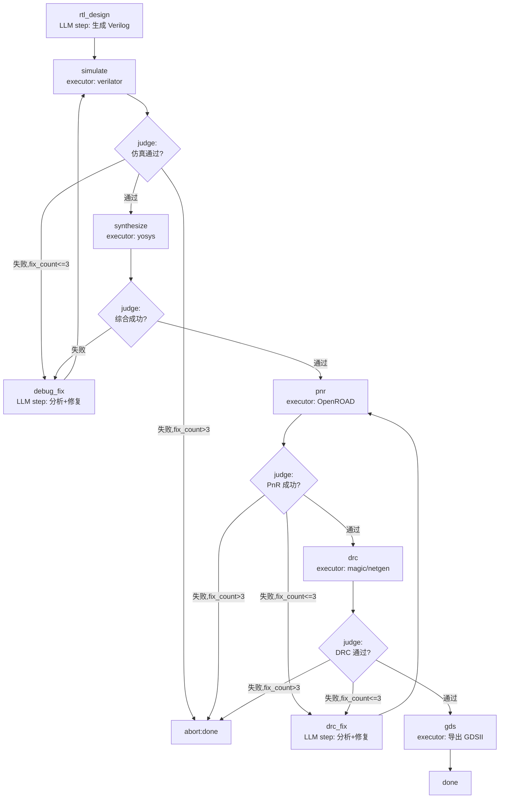

# Senza EDA Studio —— 开源 EDA 自动化芯片设计流程

> 日期：2026-07-18
> 主题：基于 Senza 构建的真实项目，用开源 EDA 工具完成 RTL→GDS 全流程
> 范围：项目设计、workflow 编排、工具集成、教学分解
> 依赖：Senza 0.3.1+ 已暴露 API + `feat/senza-api-exposure` 分支的 G1/G2/G3（假设已实现）

---

## 1. 背景

Senza 是 oh-my-harness runtime 的 Python SDK。当前仓库的 `examples/` 提供 14 个独立小示例，但缺少一个**真实复杂项目**来：

1. 验证 senza 在长流程、多工具、多 provider、失败恢复场景下的可用性
2. 作为教学示例展示 `WorkflowEngine` 的 LLM step + executor step 混用模式
3. 展示 senza 的差异化能力（judge 路由、executor、hooks、崩溃恢复、多 provider、budget/rules/pricing）

本项目用开源 EDA 工具链（verilator + yosys + OpenROAD）完成一个中等复杂度数字电路（UART）的 RTL→GDS 全流程，由 LLM 生成 RTL 并在失败时修复。

### 为什么选 EDA 场景

- **长流程**：RTL→仿真→综合→PnR→DRC→GDS，6+ 步骤，天然适合 workflow 编排
- **工具调用**：每步调外部 CLI（verilator/yosys/OpenROAD），展示 executor + shell 工具
- **报告解析**：每步产生报告（仿真日志、综合报告、DRC 报告），judge 需解析决策，展示 LLM 分析能力
- **失败迭代**：仿真失败、DRC 失败是常态，展示 LLM 修复 + workflow 回环路由
- **崩溃恢复**：流程可能跑到一半中断，展示 `with_task_store` + `restore()`
- **成本控制**：多轮 LLM 调用，展示 budget/pricing
- **安全防护**：shell 命令调用，展示 rules 审批

---

## 2. 目标

### 核心目标

1. **可运行**：给定 `config.yaml`（provider 配置）+ Docker 容器运行中，`python -m eda_studio run uart` 能跑完 RTL→GDS 并产出 `designs/uart/gds/*.gds`
2. **教学性**：项目结构清晰，每层职责明确，可作为 senza 用户的教学参考
3. **验证 senza**：覆盖 Runtime 层（WorkflowEngine + judge + executor + hooks + restore + 原生 LLM step）和新 API（budget/pricing/rules/ShellExecutor/OsEnv）。不覆盖 Agent 层（本项目用 workflow 原生 LLM step，不内嵌 AgentHarness）

### 非目标

- EDA 工具通过 Docker 镜像提供（`iic-osic-tools`），不直接安装到宿主机
- 不追求工业级 PPA 优化（教学项目，流程跑通即可）
- 不做 Web UI（纯 CLI + 文件产物）
- 不做完整的教学文档分解（先做项目，后做分解）

### 成功标准

| # | 标准 | 验证方式 |
|---|------|---------|
| S1 | `python -m eda_studio run uart` 从零产出 GDSII 文件 | 检查 `designs/uart/gds/*.gds` 存在 |
| S2 | 仿真失败时 LLM 能分析报告并修复 RTL，流程回环到 simulate | 检查 step_history 有 `to:debug_fix` → `to:simulate` 的路由记录 |
| S3 | DRC 失败时 LLM 能分析报告并修复，流程回环到 pnr | 检查 step_history 有 `to:drc_fix` → `to:pnr` 的路由记录 |
| S4 | 中断后 `python -m eda_studio restore uart` 能从断点继续 | 模拟 Ctrl+C 后 restore（传 `env=`），检查 current_step 正确 |
| S5 | 成本超限时流程停止，记录已用成本 | 设 budget=0.01 触发，检查 state="failed" + `engine.total_cost()` 有值 |
| S6a | 危险 EDA 命令被 `run_shell` 白名单拦截 | 构造 `rm -rf` 等命令，检查 executor 返回 `success=False` 且不执行 |
| S6b | LLM step 调用未授权 tool 被 G3 rules hook 拦截 | rtl_design step 试图调 `read_drc_report`，检查被 deny |

> **说明**：
> - **S7（多 provider）已移除**：`WorkflowEngine.__init__` 只接受单一 `provider` + `model`，per-step provider 切换在 AgentHarness 层（`HarnessBuilder.provider(pattern, p)`），workflow 原生 LLM step 不支持。本项目用 workflow 原生 LLM step（见 §4.3 决策），故单 provider + 单 model。
> - **重试语义**：`with_max_retries(N)` 是 per-step 连续 `Transition::Retry` 上限（judge 返回 `"retry"`），不限制 `to:` 回环。EDA 场景的「失败→debug_fix→重跑」是 `to:` 回环，不受 `max_retries` 限制，由 `max_steps=50` 兜底 + judge 内闭包计数（见 §4.6）做 per-环节 限制。

---

## 3. 架构

### 3.1 集成模式

`WorkflowEngine` 编排流程，LLM 步骤（`prompt` + `allowed_tools`）和 executor 步骤混用。工具通过 `.with_tool()` 注册到 engine 级别，LLM 步骤通过 `allowed_tools` 声明可用子集。

```
┌─────────────────────────────────────────────────────────┐
│  WorkflowEngine（外层编排）                              │
│  ┌──────────┐    ┌──────────┐    ┌──────────┐          │
│  │ rtl_design│    │ debug_fix│    │ drc_fix  │          │
│  │ (LLM step)│    │ (LLM step)│    │ (LLM step)│          │
│  │ prompt +  │    │ prompt +  │    │ prompt +  │          │
│  │ allowed_  │    │ allowed_  │    │ allowed_  │          │
│  │ tools     │    │ tools     │    │ tools     │          │
│  └────┬─────┘    └────┬─────┘    └────┬─────┘          │
│       │                │                │                │
│  ┌────▼─────┐    ┌────▼─────┐    ┌────▼─────┐          │
│  │ simulate │    │ (回环)    │    │ (回环)    │          │
│  │ (executor)│   │           │   │           │          │
│  └────┬─────┘    └──────────┘    └──────────┘          │
│       │                                                 │
│  ┌────▼─────┐    ┌──────────┐    ┌──────────┐          │
│  │synthesize│───▶│   pnr    │───▶│   drc    │───▶ gds  │
│  │ (executor)│   │ (executor)│   │ (executor)│  (executor)│
│  └──────────┘    └──────────┘    └──────────┘          │
│                                                         │
│  tools: with_tool() 注册到 engine 级别                  │
│  judge: 解析 executor 报告 → 路由决策                    │
│  hooks: 日志/成本/审计/检查点                            │
│  budget: 成本超限停止                                    │
│  rules: shell 命令审批                                  │
│  pricing: 多 provider 成本统计                          │
└─────────────────────────────────────────────────────────┘
```

### 3.2 Workflow 流程图



### 3.3 项目结构

**独立仓库**（不在 Senza 仓库内），通过 `pip install senza-sdk` 引入依赖。这额外验证了 PyPI 包的可用性。

仓库地址：`github.com/oh-my-harness/eda-studio`（待创建）

```
eda-studio/                        # 独立仓库
├── README.md                      # 项目介绍 + 快速开始
├── pyproject.toml                 # 依赖：senza-sdk>=0.3.1 (from PyPI)
├── config.example.yaml            # provider/model/budget/docker 配置示例
├── eda_studio/
│   ├── __init__.py
│   ├── __main__.py                # CLI 入口：run / restore / status
│   ├── config.py                  # 加载 config.yaml → 创建 providers + pricing
│   ├── prompts.py                 # LLM 步骤的 prompt 模板
│   ├── workflow.py                # workflow 定义 + WorkflowEngine 构建
│   ├── judge.py                   # judge 逻辑：报告解析 → 路由决策
│   ├── hooks.py                   # 日志/成本/审计/检查点 hooks
│   ├── rules.py                   # shell 命令审批 rules
│   ├── tools/                     # LLM step 可调用的 tools（with_tool 注册）
│   │   ├── __init__.py
│   │   ├── file_tools.py          # 读写 RTL/SDC/报告文件
│   │   └── report_tools.py        # 解析仿真/综合/DRC 报告摘要
│   └── executors/                 # workflow executor 步骤（EDA 工具调用）
│       ├── __init__.py
│       ├── simulate.py            # verilator 仿真 executor
│       ├── synthesize.py          # yosys 综合 executor
│       ├── pnr.py                 # OpenROAD PnR executor
│       ├── drc.py                 # DRC/LVS 检查 executor
│       └── gds.py                 # GDS 导出 executor
├── designs/                       # 设计工作区（运行时生成）
│   └── uart/                      # 默认示例设计
│       ├── rtl/                   # Verilog 源码
│       ├── sim/                   # 仿真输出
│       ├── synth/                 # 综合输出 (netlist)
│       ├── pnr/                   # PnR 输出 (DEF)
│       ├── gds/                   # GDSII 最终产物
│       └── .taskstore/            # 崩溃恢复状态
└── tests/
    ├── test_judge.py              # judge 路由逻辑
    ├── test_tools.py              # 工具单元测试
    └── test_workflow.py           # workflow 集成测试（mock EDA 工具）
```

**安装与运行**：

```bash
git clone https://github.com/oh-my-harness/eda-studio.git
cd eda-studio
pip install -e .
cp config.example.yaml config.yaml  # 编辑 provider 配置
python -m eda_studio run uart
```

---

## 4. 详细设计

### 4.1 配置系统（`config.py`）

```python
# config.yaml 示例
provider:
  type: openai            # openai | anthropic
  api_key: ${OPENAI_API_KEY}
  base_url: null          # 可选，OpenAI 兼容接口（如 DeepSeek）填此处

model: "gpt-4o"           # 所有 LLM step 共用（WorkflowEngine 单一 model）

pricing:
  gpt-4o:
    input_per_mtok: 2.5
    output_per_mtok: 10.0

budget:
  limit: 5.0              # 最大花费 $5
  exceeded_action: stop   # stop | continue

workflow:
  max_steps: 50           # 总步数上限（含回环），兜底防死循环
  max_fix_retries: 3      # 每个修复环节的最大回环次数（judge 闭包计数，见 §4.6）

shell:
  allowed_commands: ["verilator", "yosys", "openroad", "magic", "netgen", "klayout"]
  denied_args: ["rm", "chmod", "sudo", ">", "|", ";", "&", "`", "$"]

docker:
  image: "hpretl/iic-osic-tools:latest"
  container: "eda-tools"
  workdir: "/work/designs"   # 容器内挂载点
  pdk: "sky130A"             # 预装 PDK
```

**`config.py` 职责**：

```python
@dataclass
class AppConfig:
    provider: Provider              # 单一 senza provider 实例
    model: str                      # 单一 model（所有 LLM step 共用）
    pricing_table: PricingProvider  # senza PricingProvider（G2）
    budget_limit: float
    budget_exceeded_action: str     # "stop" | "continue"
    workflow_config: WorkflowConfig
    shell_config: ShellConfig       # run_shell 白名单（纯 Python 检查，见 §4.5）
    docker_config: DockerConfig     # EDA 工具容器配置

@dataclass
class WorkflowConfig:
    max_steps: int          # 总步数上限，传给 engine.with_max_steps()
    max_fix_retries: int    # per-环节 回环上限，judge 闭包用（不传 engine）

@dataclass
class ShellConfig:
    allowed_commands: list[str]     # EDA 工具白名单
    denied_args: list[str]          # 危险参数/字符

@dataclass
class DockerConfig:
    image: str          # "hpretl/iic-osic-tools:latest"
    container: str      # "eda-tools"
    workdir: str        # "/work/designs" 容器内挂载点
    pdk: str            # "sky130A"

def load_config(path: str) -> AppConfig:
    """加载 yaml → 创建 senza provider/pricing 实例"""
    # 1. 解析 yaml，展开 ${ENV_VAR}
    # 2. 按 provider.type 调 create_openai_provider / create_anthropic_provider
    # 3. 调 create_pricing_provider(pricing_table) （G2）
    # 4. 返回 AppConfig
```

> **为什么单 provider**：`WorkflowEngine.__init__(workflow_dict, provider, model, judge)` 只接受单一 `provider` + `model`。per-step provider 切换在 `HarnessBuilder.provider(pattern, p)`（AgentHarness 层），workflow 原生 LLM step 不支持。本项目用原生 LLM step（见 §4.3 决策），故单 provider。多 provider 作为后续扩展（需改用 executor 包装 AgentHarness）。

**展示的 senza 能力**：
- `create_openai_provider(api_key, base_url=...)` — OpenAI 兼容接口（含 DeepSeek）
- `create_anthropic_provider(api_key)`
- `create_pricing_provider(table)` — G2 新 API

### 4.2 Workflow 定义（`workflow.py`）

```python
def build_workflow(config: AppConfig, design_name: str) -> WorkflowEngine:
    workflow_dict = {
        "entry_step": "rtl_design",
        "steps": [
            {
                "id": "rtl_design",
                "name": "RTL 设计",
                "prompt": RTL_DESIGN_PROMPT,  # 含设计需求 + write_rtl 工具使用说明
                "allowed_tools": ["write_rtl", "read_rtl", "list_design_files"],
            },
            {
                "id": "simulate",
                "name": "仿真验证",
                "executor": "simulate",
            },
            {
                "id": "debug_fix",
                "name": "仿真修复",
                "prompt": DEBUG_FIX_PROMPT,  # 含 read_sim_report + 修复指令
                "allowed_tools": ["read_sim_report", "read_rtl", "write_rtl"],
            },
            {
                "id": "synthesize",
                "name": "逻辑综合",
                "executor": "synthesize",
            },
            {
                "id": "pnr",
                "name": "布局布线",
                "executor": "pnr",
            },
            {
                "id": "drc_fix",
                "name": "DRC 修复",
                "prompt": DRC_FIX_PROMPT,  # 含 read_drc_report + 修复指令
                "allowed_tools": ["read_drc_report", "read_sdc", "write_sdc", "read_rtl", "write_rtl"],
            },
            {
                "id": "drc",
                "name": "DRC 检查",
                "executor": "drc",
            },
            {
                "id": "gds",
                "name": "GDS 导出",
                "executor": "gds",
            },
        ],
        # edges 必须覆盖 judge 所有可能返回的 to: 目标。
        # Transition::To(next) 要求 from→next 边存在，否则 InvalidTransition→Failed。
        # 回环（simulate→debug_fix→simulate）不消耗 max_retries，由 max_steps 兜底。
        "edges": [
            {"from": "rtl_design", "to": "simulate"},
            # simulate 成功→synthesize，失败→debug_fix
            {"from": "simulate", "to": "synthesize"},
            {"from": "simulate", "to": "debug_fix"},
            {"from": "debug_fix", "to": "simulate"},       # 回环重跑仿真
            # synthesize 成功→pnr，失败→debug_fix（RTL 问题）
            {"from": "synthesize", "to": "pnr"},
            {"from": "synthesize", "to": "debug_fix"},
            # pnr 成功→drc，失败→drc_fix
            {"from": "pnr", "to": "drc"},
            {"from": "pnr", "to": "drc_fix"},
            {"from": "drc_fix", "to": "pnr"},              # 回环重跑 PnR
            # drc 成功→gds，失败→drc_fix
            {"from": "drc", "to": "gds"},
            {"from": "drc", "to": "drc_fix"},
            {"from": "gds", "to": "done"},
        ],
    }

    judge = create_judge(make_judge_fn(config))
    # 注入 OsEnv：ShellExecutor（教学示例 step）需要；EDA 工具 executor 用 Python 回调
    # + subprocess（见 §4.5），不依赖 engine 的 env。
    env = create_os_env(working_dir=".")
    engine = WorkflowEngine(
        workflow_dict, config.provider, config.model, judge, env=env,
    )

    # 注册 executors（EDA 工具步骤，Python 回调 executor）
    engine = (
        engine
        .with_executor("simulate", create_executor(simulate_executor))
        .with_executor("synthesize", create_executor(synthesize_executor))
        .with_executor("pnr", create_executor(pnr_executor))
        .with_executor("drc", create_executor(drc_executor))
        .with_executor("gds", create_executor(gds_executor))
        # 教学示例：ShellExecutor（简单 echo step，展示 create_shell_executor + OsEnv）
        # 不用于真实 EDA 工具（Docker 场景白名单失效，见 §4.5）
        .with_executor("shell", create_shell_executor(["echo", "python3"]))
        # 注册 tools（LLM 步骤可调用的工具）
        .with_tool(create_tool("write_rtl", "写 Verilog 文件", WRITE_RTL_SCHEMA, write_rtl_fn))
        .with_tool(create_tool("read_rtl", "读 Verilog 文件", READ_RTL_SCHEMA, read_rtl_fn))
        .with_tool(create_tool("list_design_files", "列出工作区文件", LIST_SCHEMA, list_files_fn))
        .with_tool(create_tool("read_sim_report", "读仿真报告", SIM_REPORT_SCHEMA, read_sim_report_fn))
        .with_tool(create_tool("read_drc_report", "读 DRC 报告", DRC_REPORT_SCHEMA, read_drc_report_fn))
        .with_tool(create_tool("read_sdc", "读时序约束", READ_SDC_SCHEMA, read_sdc_fn))
        .with_tool(create_tool("write_sdc", "写时序约束", WRITE_SDC_SCHEMA, write_sdc_fn))
        .with_hooks(make_hooks(config))
        .with_task_store(f"designs/{design_name}/.taskstore")
        .with_max_steps(config.workflow_config.max_steps)
        # 不调 with_max_retries：它限制的是连续 Transition::Retry（judge 返回 "retry"），
        # 不限制 to: 回环。EDA 场景用 to: 回环（失败→debug_fix→重跑），per-环节 限制
        # 由 judge 闭包计数实现（见 §4.6）。max_steps=50 兜底防死循环。
    )

    # G1 Budget 控制 + G3 Rules 审批：通过 with_hooks 注入（累加语义，不覆盖前面的 hooks）
    budget_hook = create_budget_exceeded_hook(make_budget_cb(config))
    rules_hook = make_rules_hook(config)  # G3，限制 LLM tool_call，见 §4.8
    engine = engine.with_hooks([budget_hook, rules_hook])

    # 共享 context 变量（不进 taskstore 的敏感数据：config 不入 ctx，见 §5.1）
    engine.set_context_variable("design_dir", f"designs/{design_name}")
    engine.set_context_variable("docker_config", config.docker_config)
    engine.set_context_variable("shell_config", config.shell_config)

    return engine
```

**展示的 senza 能力**：
- `WorkflowEngine(workflow_dict, provider, model, judge, env=env)` — 声明式 workflow + OsEnv 注入
- `create_os_env(working_dir)` — OS 执行环境（ShellExecutor 需要）
- `.with_executor(name, exec)` — executor 注册（Python 回调 + ShellExecutor 混用）
- `.with_hooks([hooks])` — hooks 注册（累加语义，多次调用不覆盖）
- `.with_task_store(dir)` — 持久化
- `.with_max_steps(n)` — 总步数上限
- `.set_context_variable(key, value)` — 共享 KV 黑板（executor 通过 ctx 读取）
- `create_judge(fn)` — judge
- `create_budget_exceeded_hook(cb)` — G1 新 API
- `create_shell_executor(commands)` — ShellExecutor（教学示例）

### 4.3 Prompt 模板（`prompts.py`）

LLM 步骤使用 WorkflowEngine 原生的 `prompt` + `allowed_tools` 机制。每个 LLM 步骤的 prompt 在 `prompts.py` 中定义，引擎自动调用 LLM 并传递 allowed_tools 中声明的工具。

**为什么不用 executor 包装 AgentHarness**：

WorkflowEngine 原生支持 LLM step（`prompt` + `allowed_tools`）和 executor step 混用。这是 senza 的设计意图——不需要在 executor 里手动创建 AgentHarness。原生方式的优势：

- hooks、compaction、context 管理、usage 统计等引擎原生能力自动生效
- 工具通过 `.with_tool()` 注册到 engine 级别，所有 LLM step 共享（通过 `allowed_tools` 控制每步可用子集）
- judge 逻辑统一（LLM step 和 executor step 的 result 都有 `output` 字段）
- 代码更简单，不需要手动管理 AgentHarness 生命周期

```python
# prompts.py

RTL_DESIGN_PROMPT = """你是一个数字电路设计专家。请根据以下需求设计 Verilog RTL：

设计需求：
{requirement}

要求：
1. 写出可综合的 Verilog 代码（不含 initial、$display 等不可综合结构）
2. 用 write_rtl 工具将代码写入 rtl/ 目录（filename 用模块名，如 uart_tx.v）
3. 用 list_design_files 确认文件已写入
4. testbench（tb_uart.v）已预置，不要写 testbench
"""

DEBUG_FIX_PROMPT = """仿真失败了。请分析报告并修复 RTL。

1. 用 read_sim_report 读取仿真报告（含错误行和失败断言）
2. 用 read_rtl 读取当前 RTL 代码
3. 分析失败原因（语法错误、时序违例、功能错误等）
4. 用 write_rtl 写入修复后的代码（保持 filename 不变）
"""

DRC_FIX_PROMPT = """DRC 检查失败了。请分析报告并修复。

1. 用 read_drc_report 读取 DRC 报告
2. 用 read_sdc 读取时序约束
3. 用 read_rtl 读取相关 RTL
4. 分析失败原因（可能是约束问题或 RTL 问题）
5. 用 write_sdc 或 write_rtl 写入修复
"""

def load_requirement(design_name: str) -> str:
    """从 designs/<design_name>/requirement.md 读取设计需求文本。"""
    path = Path(f"designs/{design_name}/requirement.md")
    return path.read_text() if path.exists() else ""

def build_prompts(config: AppConfig, design_name: str) -> dict:
    """构建各 LLM 步骤的 prompt，注入设计需求等上下文。

    返回的 dict 在 build_workflow 中用于填充 workflow_dict 的 step.prompt 字段。
    senza 的 step prompt 是纯字符串，引擎直接发给 LLM，不支持运行时变量替换，
    故必须在构建 workflow_dict 时把 requirement 格式化进去。
    """
    requirement = load_requirement(design_name)
    return {
        "rtl_design": RTL_DESIGN_PROMPT.format(requirement=requirement),
        "debug_fix": DEBUG_FIX_PROMPT,
        "drc_fix": DRC_FIX_PROMPT,
    }

**展示的 senza 能力**：
- `WorkflowEngine` 原生 LLM step（`prompt` + `allowed_tools`）— 不需要手动创建 AgentHarness
- `.with_tool()` — 工具注册到 engine 级别，通过 `allowed_tools` 控制每步可用子集
- LLM step 与 executor step 混用 — senza 的核心设计模式
- `engine.total_cost()` — 引擎级成本统计（配合 G2 pricing）

### 4.4 工具设计（`tools/`）

> **关键**：tool callback 的 `ctx` 参数是 `ToolContext`（只有 `is_cancelled()` / `send_update()`），**不是 workflow 的 KV 黑板**。tool 拿不到 `set_context_variable` 设的值。故 `design_dir` 在 `build_workflow` 时通过闭包捕获，不依赖 ctx。

#### file_tools.py

```python
def make_file_tools(design_dir: Path):
    """工厂函数：闭包捕获 design_dir，返回所有文件操作 tools。"""
    def write_rtl_fn(args: dict, ctx) -> dict:
        filename = args["filename"]  # 如 "uart_tx.v"
        content = args["content"]
        path = design_dir / "rtl" / filename
        path.parent.mkdir(parents=True, exist_ok=True)
        path.write_text(content)
        return {"content": [{"type": "text", "text": f"已写入 {path}"}], "terminate": False}

    def read_rtl_fn(args: dict, ctx) -> dict:
        filename = args["filename"]
        path = design_dir / "rtl" / filename
        if not path.exists():
            return {"content": [{"type": "text", "text": f"文件不存在: {filename}"}], "terminate": False}
        return {"content": [{"type": "text", "text": path.read_text()}], "terminate": False}

    def list_design_files_fn(args: dict, ctx) -> dict:
        """列出 design_dir 下所有文件（rtl/sim/synth/pnr/gds）。"""
        lines = []
        for sub in ["rtl", "sim", "synth", "pnr", "gds"]:
            d = design_dir / sub
            if d.exists():
                for f in sorted(d.iterdir()):
                    lines.append(f"{sub}/{f.name}")
        return {"content": [{"type": "text", "text": "\n".join(lines) or "(空)"}], "terminate": False}

    def read_sdc_fn(args: dict, ctx) -> dict:
        path = design_dir / "pnr" / "uart.sdc"
        if not path.exists():
            return {"content": [{"type": "text", "text": "无 SDC 约束文件"}], "terminate": False}
        return {"content": [{"type": "text", "text": path.read_text()}], "terminate": False}

    def write_sdc_fn(args: dict, ctx) -> dict:
        content = args["content"]
        path = design_dir / "pnr" / "uart.sdc"
        path.parent.mkdir(parents=True, exist_ok=True)
        path.write_text(content)
        return {"content": [{"type": "text", "text": f"已写入 {path}"}], "terminate": False}

    return {
        "write_rtl": write_rtl_fn, "read_rtl": read_rtl_fn,
        "list_design_files": list_design_files_fn,
        "read_sdc": read_sdc_fn, "write_sdc": write_sdc_fn,
    }
```

#### report_tools.py

```python
def make_report_tools(design_dir: Path):
    """工厂函数：闭包捕获 design_dir，返回报告读取 tools。"""
    def read_sim_report_fn(args: dict, ctx) -> dict:
        path = design_dir / "sim" / "report.txt"
        if not path.exists():
            return {"content": [{"type": "text", "text": "无仿真报告"}], "terminate": False}
        report = path.read_text()
        summary = extract_sim_errors(report)  # 截取错误行、失败断言
        return {"content": [{"type": "text", "text": summary}], "terminate": False}

    def read_drc_report_fn(args: dict, ctx) -> dict:
        path = design_dir / "pnr" / "drc.rpt"
        if not path.exists():
            return {"content": [{"type": "text", "text": "无 DRC 报告"}], "terminate": False}
        report = path.read_text()
        summary = extract_drc_violations(report)  # 截取违例规则、坐标
        return {"content": [{"type": "text", "text": summary}], "terminate": False}

    return {"read_sim_report": read_sim_report_fn, "read_drc_report": read_drc_report_fn}
```

> `build_workflow` 中调用 `make_file_tools(design_dir)` / `make_report_tools(design_dir)` 拿到回调，再 `create_tool()` 注册。`design_dir` 在闭包里，LLM 无法篡改。

### 4.5 Executor 设计（`executors/`）

每个 executor 是一个 Python 函数，签名 `(ctx: dict) -> dict`，通过 `create_executor()` 注册。ctx 字段：`step_id` / `step_name` / `config`（step 的 executor_config）/ `prev_output` / `context`（engine 的 KV 黑板快照）。返回 dict 必须含 `output: str`，可选 `structured: dict`。

> **为什么用 Python 回调 executor 而非 ShellExecutor**：EDA 工具在 Docker 容器内，`ShellExecutor` 的白名单按 command 名过滤，Docker 场景下 command 都是 `docker`，白名单无法区分 `verilator` vs `rm`（见 N2 分析）。故 EDA 工具用 Python 回调 + `subprocess.run`，在 `run_shell` 内部自行实现白名单。`ShellExecutor` 仅用于教学示例 step（简单 `echo`）。

#### `run_shell()` 封装（`executors/__init__.py`）

```python
import subprocess
from pathlib import Path

class ShellSafetyError(Exception):
    """命令未通过白名单检查。"""

def run_shell(cmd: list[str], cwd: Path, docker_config: DockerConfig,
              shell_config: ShellConfig) -> subprocess.CompletedProcess:
    """在 Docker 容器内执行 EDA 工具命令，执行前做白名单检查。

    - cmd[0] 必须在 shell_config.allowed_commands 里（verilator/yosys/...）
    - cmd 拼接后不能含 shell_config.denied_args 里的危险字符
    - 用 bash -lc 包装（容器 entrypoint 通过 login profile 设 PATH）
    - 本地 designs/ 目录挂载到容器 /work/designs/，cwd 显式前缀剥离转换
    """
    if not cmd:
        raise ShellSafetyError("空命令")
    tool = cmd[0]
    if tool not in shell_config.allowed_commands:
        raise ShellSafetyError(f"工具 {tool!r} 不在白名单 {shell_config.allowed_commands}")

    # 宿主机路径 → 容器内路径：显式前缀剥离，不用 str.replace（避免误替换）
    host_designs = Path("designs").resolve()
    try:
        rel = cwd.relative_to(host_designs)
        container_cwd = f"{docker_config.workdir}/{rel}"
    except ValueError:
        raise ShellSafetyError(f"cwd {cwd} 不在 designs/ 下")

    cmdline = " ".join(cmd)
    for danger in shell_config.denied_args:
        if danger in cmdline:
            raise ShellSafetyError(f"命令含危险字符 {danger!r}: {cmdline}")

    docker_cmd = [
        "docker", "exec", "-w", container_cwd,
        docker_config.container,  # "eda-tools"
        "bash", "-lc", cmdline,   # login shell，PATH 由容器 profile 设置
    ]
    return subprocess.run(docker_cmd, capture_output=True, text=True, timeout=600)
```

> executor 从 `ctx["context"]` 读 `docker_config` 和 `shell_config`（由 `set_context_variable` 设置）。`PDK=sky130A` 由容器启动时设置。S6a 验证 `ShellSafetyError` 拦截危险命令。

#### testbench fixture

`designs/uart/rtl/tb_uart.v` 是**预置 fixture**（不由 LLM 生成），随仓库提供。`rtl_design` step 的 prompt 明确告诉 LLM「testbench 已预置，不要写」。simulate executor 的 `rtl_files` 要排除 `tb_uart.v`（它作为 `--top-module` 单独传）。

#### simulate.py

```python
def simulate_executor(ctx: dict) -> dict:
    """verilator 仿真"""
    design_dir = Path(ctx["context"]["design_dir"])
    docker_cfg = ctx["context"]["docker_config"]
    shell_cfg = ctx["context"]["shell_config"]

    rtl_files = [f for f in (design_dir / "rtl").glob("*.v") if f.name != "tb_uart.v"]
    tb_file = design_dir / "rtl" / "tb_uart.v"  # 预置 fixture
    if not tb_file.exists():
        return {"output": "testbench 缺失: tb_uart.v", "structured": {"success": False}}

    cmd = [
        "verilator", "--binary", "--timing",
        "-Wall",
        "--top-module", "tb_uart",
        *[str(f) for f in rtl_files], str(tb_file),
        "-o", "sim_out",
    ]
    try:
        result = run_shell(cmd, cwd=design_dir / "sim", docker_config=docker_cfg,
                           shell_config=shell_cfg)
        run_result = run_shell(["./sim_out"], cwd=design_dir / "sim",
                               docker_config=docker_cfg, shell_config=shell_cfg)
    except ShellSafetyError as e:
        return {"output": str(e), "structured": {"success": False, "safety_error": True}}

    report = parse_verilator_output(result.stderr, run_result.stdout)
    (design_dir / "sim" / "report.txt").write_text(report)

    return {
        "output": report,
        "structured": {"success": run_result.returncode == 0,
                       "report_path": str(design_dir / "sim" / "report.txt")},
    }
```

#### synthesize.py

```python
def synthesize_executor(ctx: dict) -> dict:
    """yosys 综合"""
    design_dir = Path(ctx["context"]["design_dir"])
    docker_cfg = ctx["context"]["docker_config"]
    shell_cfg = ctx["context"]["shell_config"]
    rtl_files = sorted(f for f in (design_dir / "rtl").glob("*.v") if f.name != "tb_uart.v")
    json_out = design_dir / "synth" / "netlist.json"

    script = f"read_verilog {' '.join(str(f) for f in rtl_files)}; synth -top uart; stat; write_json {json_out}; write_verilog {design_dir / 'synth' / 'netlist.v'}"
    try:
        result = run_shell(["yosys", "-q", "-p", script], cwd=design_dir / "synth",
                           docker_config=docker_cfg, shell_config=shell_cfg)
    except ShellSafetyError as e:
        return {"output": str(e), "structured": {"success": False, "safety_error": True}}

    report = result.stdout + result.stderr
    (design_dir / "synth" / "report.txt").write_text(report)
    return {
        "output": report,
        "structured": {"success": result.returncode == 0 and json_out.exists(),
                       "report_path": str(design_dir / "synth" / "report.txt")},
    }
```

#### pnr.py

```python
def pnr_executor(ctx: dict) -> dict:
    """OpenROAD 布局布线。floorplan 由 initialize_floorplan 生成，不需要 read_def。"""
    design_dir = Path(ctx["context"]["design_dir"])
    docker_cfg = ctx["context"]["docker_config"]
    shell_cfg = ctx["context"]["shell_config"]
    netlist = design_dir / "synth" / "netlist.v"

    tcl = f"""
read_libs sky130A/sky130_fd_sc_hd__tt_025C_1v80.lib
read_lef sky130A/sky130_fd_sc_hd.lef
read_verilog {netlist}
link_design uart
initialize_floorplan -utilization 40 -site unithd
place_pins -hor_layers metal2 -ver_layers metal3
global_placement
detailed_placement
global_route
detailed_route
write_def {design_dir / 'pnr' / 'uart_pnr.def'}
"""
    try:
        result = run_shell(["openroad", "-exit_on_error", "-no_splash", "-cmd", tcl],
                           cwd=design_dir / "pnr",
                           docker_config=docker_cfg, shell_config=shell_cfg)
    except ShellSafetyError as e:
        return {"output": str(e), "structured": {"success": False, "safety_error": True}}

    report = result.stdout + result.stderr
    (design_dir / "pnr" / "report.txt").write_text(report)
    return {
        "output": report,
        "structured": {"success": result.returncode == 0,
                       "report_path": str(design_dir / "pnr" / "report.txt")},
    }
```

#### drc.py

```python
def drc_executor(ctx: dict) -> dict:
    """magic DRC 检查。"""
    design_dir = Path(ctx["context"]["design_dir"])
    docker_cfg = ctx["context"]["docker_config"]
    shell_cfg = ctx["context"]["shell_config"]
    def_file = design_dir / "pnr" / "uart_pnr.def"

    tcl = f"""
drc {def_file} {design_dir / 'pnr' / 'drc.rpt'}
exit
"""
    try:
        result = run_shell(["magic", "-noconsole", "-dnull", "-cmd", tcl],
                           cwd=design_dir / "pnr",
                           docker_config=docker_cfg, shell_config=shell_cfg)
    except ShellSafetyError as e:
        return {"output": str(e), "structured": {"success": False, "safety_error": True}}

    report = result.stdout + result.stderr
    drc_report = design_dir / "pnr" / "drc.rpt"
    if drc_report.exists():
        report += "\n--- DRC violations ---\n" + drc_report.read_text()
    (design_dir / "pnr" / "report.txt").write_text(report)
    return {
        "output": report,
        "structured": {"success": "0 violations" in report.lower() or "violation" not in report.lower(),
                       "report_path": str(design_dir / "pnr" / "report.txt")},
    }
```

#### gds.py

```python
def gds_executor(ctx: dict) -> dict:
    """klayout 导出 GDSII。"""
    design_dir = Path(ctx["context"]["design_dir"])
    docker_cfg = ctx["context"]["docker_config"]
    shell_cfg = ctx["context"]["shell_config"]
    def_file = design_dir / "pnr" / "uart_pnr.def"
    gds_out = design_dir / "gds" / "uart.gds"

    tcl = f"""
load {def_file}
gds write {gds_out}
exit
"""
    try:
        result = run_shell(["klayout", "-b", "-r", "-cmd", tcl],
                           cwd=design_dir / "gds",
                           docker_config=docker_cfg, shell_config=shell_cfg)
    except ShellSafetyError as e:
        return {"output": str(e), "structured": {"success": False, "safety_error": True}}

    report = result.stdout + result.stderr
    return {
        "output": report,
        "structured": {"success": result.returncode == 0 and gds_out.exists(),
                       "gds_path": str(gds_out)},
    }
```

### 4.6 Judge 设计（`judge.py`）

```python
def make_judge_fn(config: AppConfig):
    # judge ctx 是只读 dict（PyJudge.decide 构造），字段：
    #   step_id / output / step_count / retry_count / structured
    # retry_count 是 engine 维护的「当前 step 连续 Transition::Retry 次数」，
    # 只在 judge 返回 "retry" 时累加；to: 回环不累加。故 per-环节 回环计数
    # 用闭包变量自行维护（judge 无法写回 engine 的 context 黑板）。
    fix_counts = {"simulate": 0, "pnr": 0, "drc": 0}
    max_fix = config.workflow_config.max_fix_retries

    def judge(ctx: dict) -> str:
        step_id = ctx["step_id"]
        # executor step 的结果在 structured；LLM step 的结果在 output
        structured = ctx.get("structured") or {}
        success = structured.get("success", False)

        if step_id == "rtl_design":
            # LLM step：output 非空即继续（LLM 已调 write_rtl 写文件）
            return "to:simulate" if ctx.get("output") else "abort:done"

        if step_id == "simulate":
            if success:
                fix_counts["simulate"] = 0  # 成功则重置
                return "to:synthesize"
            fix_counts["simulate"] += 1
            if fix_counts["simulate"] > max_fix:
                return "abort:done"
            return "to:debug_fix"

        if step_id == "debug_fix":
            return "to:simulate"  # 修复后重跑仿真

        if step_id == "synthesize":
            return "to:pnr" if success else "to:debug_fix"

        if step_id == "pnr":
            if success:
                fix_counts["pnr"] = 0
                return "to:drc"
            fix_counts["pnr"] += 1
            if fix_counts["pnr"] > max_fix:
                return "abort:done"
            return "to:drc_fix"

        if step_id == "drc_fix":
            return "to:pnr"  # 修复后重跑 PnR

        if step_id == "drc":
            if success:
                fix_counts["drc"] = 0
                return "to:gds"
            fix_counts["drc"] += 1
            if fix_counts["drc"] > max_fix:
                return "abort:done"
            return "to:drc_fix"

        if step_id == "gds":
            return "done"

        return "abort:done"

    return judge
```

**展示的 senza 能力**：
- `create_judge(fn)` — Python callable → judge
- `to:step_id` / `abort:done` — 路由语法（`to:` 要求 edge 存在，否则 InvalidTransition）
- judge ctx 只读字段：`step_id` / `output` / `step_count` / `retry_count` / `structured`
- `retry_count` 由 engine 维护（只对 `"retry"` 返回值累加），judge 只读
- per-环节 回环计数用闭包变量（judge 无法写回 context 黑板）

### 4.7 Hooks 设计（`hooks.py`）

```python
def make_hooks(config: AppConfig):
    hooks = []

    # 日志 hook
    @create_before_turn_hook
    def log_before_turn(ctx: dict) -> None:
        step_id = ctx["step_id"]
        logger.info(f"▶ {step_id} 开始")

    @create_after_turn_hook
    def log_after_turn(ctx: dict) -> None:
        step_id = ctx["step_id"]
        duration = ctx.get("duration_ms", 0)
        logger.info(f"✓ {step_id} 完成 ({duration}ms)")

    hooks.extend([log_before_turn, log_after_turn])

    # 工具调用审计 hook
    # after_tool_call 返回 None = 不修改结果；返回 str/dict = 覆盖 tool 结果
    @create_after_tool_call_hook
    def audit_tool_call(ctx: dict):
        tool_name = ctx.get("tool_name", "")
        logger.info(f"  tool call: {tool_name}")
        return None  # 审计只记录，不改结果

    hooks.append(audit_tool_call)
    return hooks
```

**展示的 senza 能力**：
- `create_before_turn_hook` / `create_after_turn_hook` — 生命周期（cb: `dict → None`）
- `create_after_tool_call_hook` — 工具调用审计（cb: `dict → Any`，返回 None 不改结果，返回 str/dict 覆盖）

### 4.8 Rules 审批（`rules.py`，G3 新 API）

> **定位**：`RuleBasedApprovalHook` 实现 `BeforeToolCallHook`，只拦截 **LLM tool_call**，拦不到 executor 内的 subprocess。EDA 工具的 shell 安全由 `run_shell` 白名单负责（见 §4.5，S6a）。本节 rules 用于**限制 LLM step 可调用的 tool 子集**（S6b）——如 rtl_design step 只能调 `write_rtl`/`read_rtl`/`list_design_files`，试图调 `read_drc_report` 被 deny。

```python
def make_rules_hook(config: AppConfig):
    """构建 LLM tool_call 审批规则链。

    顺序：先 deny 危险 tool，再 allow 白名单，fallback deny。
    RuleChain 首条匹配生效，通配 Allow 必须排在特定 Deny 之后（见 chain.rs 注释）。
    """
    builder = create_rule_chain()

    # 规则1：deny 所有 LLM step 调用非授权 tool（如 rtl_design 调 read_drc_report）
    # create_contains_predicate(allowed) 检查 tool_name ∈ allowed
    builder = builder.rule(
        tool_name="*",
        predicate=create_contains_predicate(["read_drc_report", "write_sdc"]),
        on_match="deny",  # 这两个 tool 只有 drc_fix step 该调
    )

    # 规则2：allow 白名单 tool（所有 LLM step 都可调的安全 tool）
    builder = builder.rule(
        tool_name="*",
        predicate=create_contains_predicate(
            ["write_rtl", "read_rtl", "list_design_files", "read_sim_report", "read_sdc"]
        ),
        on_match="allow",
    )

    # fallback：默认拒绝
    builder = builder.fallback("deny")
    chain = builder.build()
    return create_rule_approval_hook(chain)
```

> 注：上面是简化示例，实际按 step 粒度限制用 `with_step_plugin` + per-step `RuleChain` 更合适。S6b 验证：rtl_design step 试图调 `read_drc_report` → 被 deny。

**展示的 senza 能力**（G3）：
- `create_rule_chain()` — RuleChainBuilder
- `create_contains_predicate(allowed)` — 检查 tool_name ∈ allowed
- `create_regex_field_predicate(arg_path, pattern)` — 检查 args 字段匹配正则
- `RuleChainBuilder.rule(tool_name, predicate, on_match).fallback(decision).build()` — 链式构建，首条匹配生效
- `create_rule_approval_hook(chain)` — 生成 `BeforeToolCallHook`（只拦 LLM tool_call）

### 4.9 Budget 控制（G1 新 API）

```python
def make_budget_cb(config: AppConfig):
    def on_budget_exceeded(cost: dict, limit: float) -> bool:
        logger.warning(f"预算超限！已用 ${cost['total_cost']:.2f} / ${limit:.2f}")
        # 返回 False → 停止流程；True → 继续
        return config.budget_exceeded_action == "continue"
    return on_budget_exceeded

# 在 workflow.py 中：
budget_hook = create_budget_exceeded_hook(make_budget_cb(config))
engine = engine.with_hooks([budget_hook])  # 累加到已有 hooks（见 §4.2）
```

> `WorkflowEngine` 无 `with_budget` 方法，通过 `with_hooks([budget_hook])` 注入。`budget_hook` 实现 `ShouldStopHook`，runtime 自动调用。S5 验证：设 budget=0.01，检查 `engine.state()=="failed"` + `engine.total_cost()` 有值。

**展示的 senza 能力**（G1）：
- `create_budget_exceeded_hook(cb)` — cb(cost, limit) -> bool（False 停止）
- `engine.with_hooks([budget_hook])` — workflow 级注入
- `engine.total_cost()` — 成本查询（配合 G2 pricing）

### 4.10 崩溃恢复

```python
# __main__.py
def cmd_restore(design_name: str, config_path: str):
    config = load_config(config_path)
    store_dir = f"designs/{design_name}/.taskstore"

    # 读取 task_id
    task_id = (Path(store_dir) / "task_id").read_text().strip()

    # restore 必须传 env=，否则 ShellExecutor 步骤恢复后失败（UnsupportedEnv）
    env = create_os_env(working_dir=".")
    engine = WorkflowEngine.restore(
        store_dir, task_id,
        provider=config.provider,
        model=config.model,
        judge=create_judge(make_judge_fn(config)),
        env=env,
    )
    # 恢复后需重新注册 executors/tools/hooks（restore 不持久化这些）
    engine = (engine
        .with_executor("simulate", create_executor(simulate_executor))
        .with_executor("synthesize", create_executor(synthesize_executor))
        .with_executor("pnr", create_executor(pnr_executor))
        .with_executor("drc", create_executor(drc_executor))
        .with_executor("gds", create_executor(gds_executor))
        .with_executor("shell", create_shell_executor(["echo", "python3"]))
        .with_hooks(make_hooks(config))
        .with_hooks([create_budget_exceeded_hook(make_budget_cb(config)),
                     make_rules_hook(config)]))
    # 恢复 context 变量（taskstore 不含这些）
    engine.set_context_variable("design_dir", f"designs/{design_name}")
    engine.set_context_variable("docker_config", config.docker_config)
    engine.set_context_variable("shell_config", config.shell_config)

    print(f"恢复到步骤: {engine.current_step()}")
    print(f"已完成: {len(engine.step_history())} 步")
    engine.run()
```

> 注：`restore` 不持久化 executors/tools/hooks（只有 workflow 状态和 context 黑板进 taskstore）。恢复后需重新注册。context 黑板是否进 taskstore 取决于 runtime 实现——保险起见重新 `set_context_variable`。

**展示的 senza 能力**：
- `WorkflowEngine.restore(store_dir, task_id, provider, model, judge, env=env)` — 类方法恢复（含 env）
- `.current_step()` / `.step_history()` — 状态查询
- 恢复后重新 `with_executor` / `with_hooks` / `set_context_variable`

### 4.11 CLI 入口

```python
# __main__.py
"""
Usage:
  python -m eda_studio run <design> [--config config.yaml]
  python -m eda_studio restore <design> [--config config.yaml]
  python -m eda_studio status <design>
"""
```

---

## 5. 数据流

### 5.1 运行时上下文（ctx）

senza 有**两种 ctx**，字段不同：

**executor ctx**（Python 回调 executor 收到的 dict，由 `PyExecutor.execute` 构造）：

```python
ctx = {
    "step_id": "simulate",
    "step_name": "仿真验证",
    "config": None,                # step 的 executor_config（本项目 executor 不用）
    "prev_output": "...",          # 上一步的 output 字符串
    "context": {                   # engine 的 KV 黑板快照（set_context_variable 设的）
        "design_dir": "designs/uart",
        "docker_config": DockerConfig(...),
        "shell_config": ShellConfig(...),
    },
}
```

**judge ctx**（judge callback 收到的只读 dict，由 `PyJudge.decide` 构造）：

```python
ctx = {
    "step_id": "simulate",
    "output": "...",               # 当前 step 的 output
    "step_count": 3,               # 已完成步数
    "retry_count": 0,              # engine 维护：当前 step 连续 Retry 次数（只对 "retry" 累加）
    "structured": {"success": True, ...},  # 当前 step 的 structured 结果
}
```

> **敏感数据不进 ctx**：`AppConfig` 含 API key，**不**通过 `set_context_variable` 放入 context 黑板（会进 taskstore 落盘）。只放 `docker_config` / `shell_config` / `design_dir` 这些非敏感配置。provider 实例在 `build_workflow` 时闭包捕获，不经过 ctx。

### 5.2 文件产物

每步产出文件到 `designs/<name>/` 对应子目录，executor 和 agent 都通过 `ctx["design_dir"]` 定位。

```
designs/uart/
│   ├── tb_uart.v         # 预置 fixture（随仓库版本管理，不由 LLM 生成）
│   ├── uart_tx.v         # rtl_design 产出
│   └── uart_rx.v
├── sim/
│   ├── sim_out           # simulate 产出（二进制）
│   └── report.txt        # simulate 产出（报告）
├── synth/
│   ├── netlist.json      # synthesize 产出
│   ├── netlist.v
│   └── report.txt
├── pnr/
│   ├── uart_pnr.def      # pnr 产出
│   └── drc.rpt           # drc 产出
├── gds/
│   └── uart.gds          # gds 产出（最终产物）
└── .taskstore/           # 崩溃恢复状态
```

---

## 6. 错误处理

| 场景 | 处理 |
|------|------|
| EDA 工具未安装（容器未启动） | executor 的 `run_shell` 抛 `subprocess.TimeoutExpired` 或返回非零，executor 返回 `structured.success=False`，judge 路由 `to:debug_fix` 或超限 `abort:done` |
| LLM 生成 RTL 语法错误 | verilator 编译失败 → simulate `structured.success=False` → judge 路由 `to:debug_fix` |
| 仿真修复超过 max_fix_retries | judge 闭包计数超限，返回 `abort:done`（`with_max_retries` 不管 `to:` 回环） |
| DRC 反复失败 | 同上，drc_fix 闭包计数超限 |
| 回环死循环兜底 | `with_max_steps(50)` 兜底，`step_history.len() >= 50 → fail_task` |
| API key 缺失 | `load_config()` 启动时报错 |
| LLM API 超时 | engine 的 step timeout（`StepExecutionPolicy.timeout_ms`）触发，step 失败 |
| 成本超限 | budget hook 触发，`engine.state()=="failed"`，`engine.total_cost()` 有值 |
| 危险 EDA 命令（S6a） | `run_shell` 白名单检查抛 `ShellSafetyError`，executor 返回 `structured.success=False` + `safety_error=True` |
| LLM 调用未授权 tool（S6b） | G3 `RuleBasedApprovalHook` 拦截，返回 deny（`BeforeToolCallDecision::Deny`） |
| judge 返回 `to:X` 但无 edge | engine 抛 `InvalidTransition: no edge from ... to ...`，task failed |

---

## 7. 测试策略

### 7.1 单元测试

| 测试 | 覆盖 | 方法 |
|------|------|------|
| `test_judge.py` | judge 路由逻辑 + 闭包计数 | 构造 judge ctx dict（含 structured.success/retry_count），断言返回的 transition 字符串；多次调用验证 fix_counts 递增 + 超限 abort |
| `test_tools.py` | file/report 工具（闭包捕获 design_dir） | tmp_path 构造 design_dir，调 `make_file_tools(tmp_path)` 拿回调，断言读写正确 |
| `test_config.py` | 配置加载 | tmp config.yaml，断言 provider/pricing/docker_config 创建 |
| `test_run_shell.py` | run_shell 白名单（S6a） | mock subprocess.run，构造 `rm -rf` 等命令，断言抛 `ShellSafetyError` |

### 7.2 集成测试

| 测试 | 覆盖 | mock 粒度 |
|------|------|----------|
| `test_workflow.py` | workflow 端到端路由 + 回环 | **mock `run_shell`**（monkeypatch 替换为返回固定报告的 stub），不 mock executor 函数本身——executor 逻辑跑真，只是 EDA 工具调用被 stub |
| `test_workflow.py` | S2/S3 回环验证 | mock simulate 失败 → 断言 step_history 有 `to:debug_fix` → `to:simulate` |
| `test_workflow.py` | max_fix_retries 超限 | mock 连续失败 → 断言 fix_counts 超限后 `abort:done` |
| `test_workflow.py` | max_steps 兜底 | mock 永远失败 → 断言 `step_history.len() >= 50 → state=="failed"` |

**不依赖真实 EDA 工具和 LLM API**——`run_shell` 被 monkeypatch，executor 返回固定报告；LLM step 用 senza 的 mock provider（或跳过 LLM step 直接测 executor 路由）。

### 7.3 手动验收

用真实 EDA 工具（Docker 容器）+ LLM API 跑 UART 设计，验证 S1-S6 成功标准（S7 已移除）。

---

依赖声明见 [`pyproject.toml`](../../pyproject.toml)(senza-sdk + pyyaml + fastapi/uvicorn/websockets)。

> **开发期安装**：`./scripts/install-senza-dev.sh` 从本地 `../Senza` 仓库 editable 安装（`maturin develop`），改 Senza 源码后重跑即可更新。Senza 的 Cargo.toml 用 git rev 锁定 runtime commit（`senza-pkg/runtime.lock`），从 GitHub fetch——不依赖本地 runtime checkout。详见 CLAUDE.md「开发环境」。

### EDA 工具（Docker 镜像）

所有 EDA 工具通过 [`iic-osic-tools`](https://github.com/iic-jku/iic-osic-tools) Docker 镜像提供，**不在宿主机安装**。镜像基于 Ubuntu 24.04，原生支持 amd64 和 arm64（Apple Silicon 无需 Rosetta），预装以下工具和 PDK：

| 工具 | 用途 | 镜像内路径 |
|------|------|-----------|
| verilator | RTL 仿真 | `/foss/tools/bin/verilator` |
| yosys | 逻辑综合 | `/foss/tools/bin/yosys` |
| openroad | 布局布线 | `/foss/tools/bin/openroad` |
| magic | DRC / 版图 | `/foss/tools/bin/magic` |
| netgen | LVS | `/foss/tools/bin/netgen` |
| klayout | GDS 查看/导出 | `/foss/tools/klayout/klayout` |

> 注：路径以 `iic-osic-tools` 镜像实际为准。`run_shell` 用 `bash -lc` 包装命令，PATH 由容器 login profile 设置，executor 代码只写工具名（如 `verilator`），不写绝对路径。

### 工艺库

- SkyWater Sky130 `sky130A`（开源 PDK，镜像预装）
- 环境变量 `PDK=sky130A`、`PDKPATH`、`STD_CELL_LIBRARY=sky130_fd_sc_hd` 由容器启动时设置

### Docker 容器管理

```bash
# 启动容器（挂载 designs 目录，保持后台运行）
# 必须用 --skip sleep infinity：镜像 entrypoint 默认启动 VNC/X11，--skip 跳过
docker run -d --name eda-tools \
  -v $(pwd)/designs:/work/designs \
  -e PDK=sky130A \
  hpretl/iic-osic-tools:latest \
  --skip sleep infinity

# senza 程序通过 docker exec 调用容器内工具（必须用 bash -lc）
docker exec eda-tools bash -lc 'verilator --version'
docker exec -w /work/designs/uart/sim eda-tools bash -lc 'verilator --binary ...'
```

`run_shell()` 封装了 `docker exec ... bash -lc` 前缀（见 §4.5），executor 代码不直接感知 Docker。

---

## 9. 展示的 senza 能力总结

| 能力 | 展示位置 | API |
|------|---------|-----|
| **WorkflowEngine** 声明式 workflow | workflow.py | `WorkflowEngine(dict, provider, model, judge, env=env)` |
| **OsEnv 注入** | workflow.py | `create_os_env(working_dir)` |
| **judge 条件路由** | judge.py | `create_judge(fn)`, `to:step` / `abort:done` / `retry` |
| **judge ctx 字段** | judge.py | `ctx["step_id"]` / `output` / `retry_count` / `structured` |
| **Python 回调 executor** | executors/ | `create_executor(fn)`, `.with_executor()` |
| **ShellExecutor（教学）** | workflow.py | `create_shell_executor(commands)` — 简单 echo step，非 EDA 工具 |
| **原生 LLM step** | workflow.py | step 的 `prompt` + `allowed_tools`（不内嵌 AgentHarness） |
| **create_tool** | tools/ | `create_tool(name, desc, schema, fn)`，闭包捕获 design_dir |
| **hooks（3 种）** | hooks.py | before_turn / after_turn / after_tool_call |
| **with_hooks 累加语义** | workflow.py | 多次 `with_hooks` 调用不覆盖，hooks 累加 |
| **set_context_variable** | workflow.py | KV 黑板，executor 通过 `ctx["context"]` 读 |
| **崩溃恢复** | __main__.py | `with_task_store()`, `WorkflowEngine.restore(..., env=env)` |
| **G1 Budget** | workflow.py | `create_budget_exceeded_hook(cb)`, `with_hooks([budget_hook])` |
| **G2 Pricing** | config.py | `create_pricing_provider(table)`, `engine.total_cost()` |
| **G3 Rules 审批** | rules.py | `create_rule_chain()`, predicates, `create_rule_approval_hook()` — 限制 LLM tool_call |
| **with_max_steps** | workflow.py | 总步数上限，兜底防回环死循环 |

> **不展示**（因单 provider + 原生 LLM step 决策）：AgentHarness、HarnessBuilder fluent API、多 provider glob 路由、streaming 事件、`agent.usage()`、`builder.budget()`。这些在 AgentHarness 层，本项目不内嵌 AgentHarness。

---

## 10. 教学分解（后续阶段）

项目跑通后，再分解为教学材料：

1. **项目结构概览** — LLM step + executor step 混用模式
2. **Provider 配置** — 单 provider + pricing + OsEnv 注入
3. **Tool 定义** — LLM 可调用的工具
4. **Prompt 模板** — 每个 LLM 步骤的 prompt 设计
5. **Executor 设计** — EDA 工具调用
6. **Workflow 定义** — 声明式流程图
7. **Judge 路由** — 报告解析 + 条件跳转
8. **Hooks** — 可观测性
9. **Budget/Rules** — 安全与成本控制
10. **崩溃恢复** — 持久化与恢复

每章配可运行代码片段。这是后续独立工作，不在本 spec 范围。

---

## 11. 不做的事

- 不修改 Senza / Runtime 源码（本项目是纯消费者，但**可以查看**上游源码用于理解行为和定位问题，见 CLAUDE.md「Issue 路由」）
- 遇到上游功能不足或 bug，按 CLAUDE.md「Issue 路由」提 issue（Senza Python 接口 → Senza 仓库；Runtime Rust 核心 → Runtime 仓库），不自行绕过
- 不做 EDA 工具安装脚本
- 不做 Web UI
- 不做工业级 PPA 优化
- 不做完整教学文档（后续阶段）
- 不支持模拟电路设计
- 不做多工艺库切换（只用 Sky130）
- 不做 CI（依赖 Docker 容器和 LLM API，难以在 CI 环境运行）

---

## 12. 优先级与实现顺序

| 阶段 | 内容 | 依赖 |
|------|------|------|
| P1 | 项目骨架 + config.py + CLI + `install-senza-dev.sh` | 无 |
| P2 | tools/（闭包工厂）+ prompts.py | P1 |
| P3 | executors/（5 个 EDA executor + run_shell 白名单）+ tb_uart.v fixture | P2 |
| P4 | workflow.py（edges 补全 + OsEnv 注入）+ judge.py（闭包计数） | P3 |
| P5 | hooks.py + rules.py + budget（累加 with_hooks） | P4 |
| P6 | 崩溃恢复 + CLI restore 命令（传 env=） | P4 |
| P7 | UART 设计需求 requirement.md | P5 |
| P8 | 端到端运行 + 验收 S1-S6（S7 已移除） | P7 |
| P9 | 测试套件（mock run_shell，不依赖真实 EDA/LLM） | P8 |
